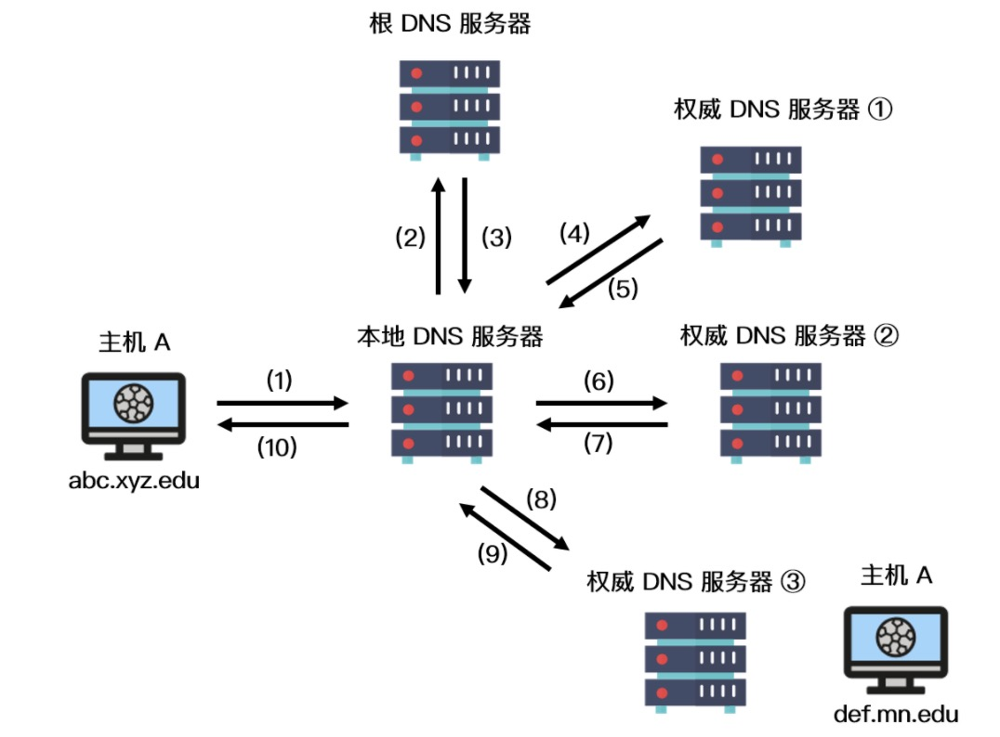
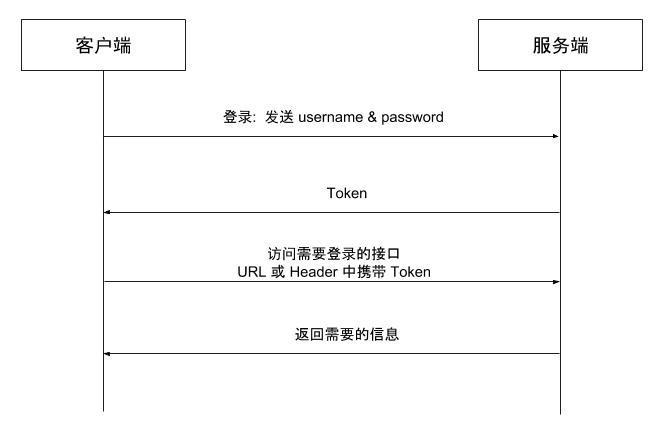
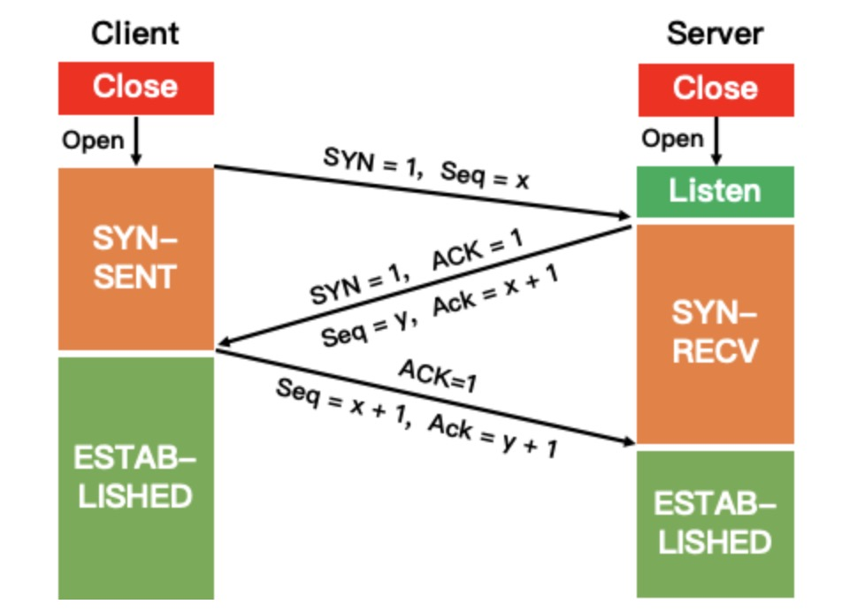
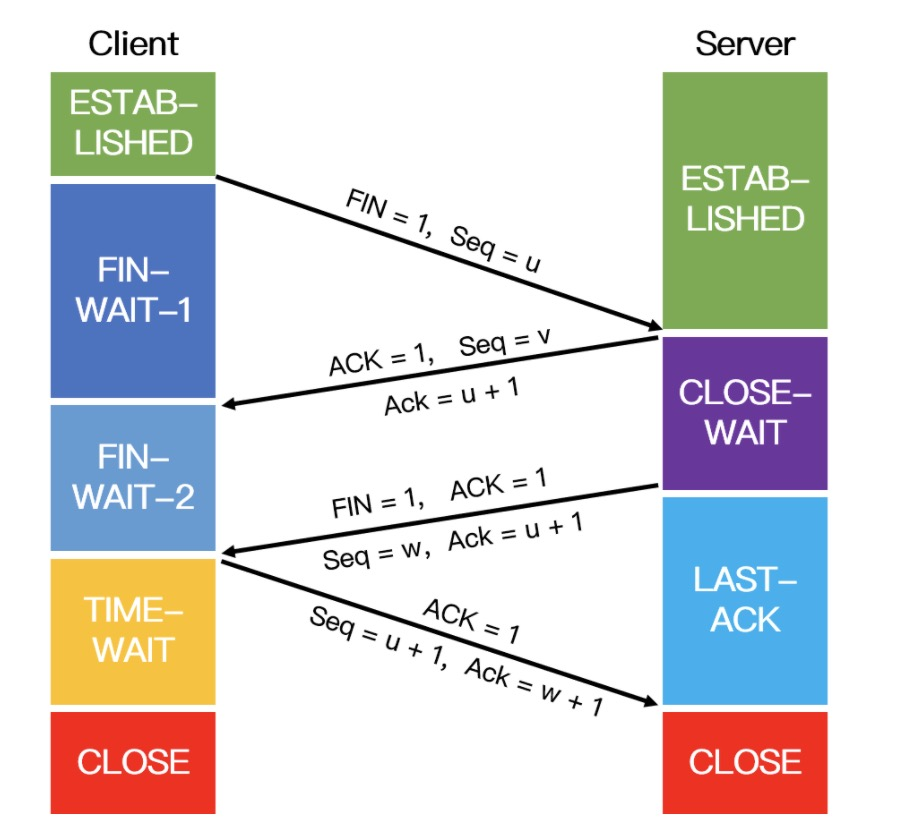

<!--
 * @Author: uestc.zyj@gmail.com
 * @Date: 2021-09-22 13:01:35
 * @LastEditTime: 2021-09-26 09:39:14
 * @Description: network interview questions
 * @FilePath: /interviews/net/net.md
-->

# 计算机网络八股文

## 1. 网址访问过程详解

第一件事就是解析 url 得到域名，通过 **DNS 协议** 获取到该域名的 ip 地址，得到 ip 后浏览器会先与服务器通过 TCP 三次握手建立连接，然后构建 HTTP 请求，将 HTTP 的传输工作交给操作系统的协议栈，发送请求成功后，浏览器会从服务端拿到该页面的 HTML 以及资源文件，浏览器会 渲染页面，呈现出我们所看到的模样。


浏览器在拿到 url 时，首先会对 url 进行解析，将域名与实际的文件路径分离，然后需要使用 DNS 协议，通过域名得到 IP 地址。
**首先浏览器会查询浏览器缓存，如果有这个网址就可以直接获取到 IP，如果没有就进一步访问本机缓存，如果本机缓存也没有才会发起 DNS 请求。**
而 DNS 的服务器是一个树状结构，对于域名来说是倒着进行解析的，根节点是根 DNS 服务器，他的子节点为 com、cn 这种顶级域 dns 服务器，然后进一步向下进行解析。
以 baidu.com 为例，当我们的电脑需要发起 DNS 请求的时候，会先对根 DNS 服务器发起请求，这个服务器的 IP 地址一般在每台电脑上都有，我们一般会设置为 8.8.8.8 或者 114.114.114.114，我们的电脑在访问根 DNS 服务器后，会得到 con 域 DNS 服务器的 IP，然后会继续访问 con 域 DNS 服务器，这时就能得到 baicu.com 的 IP 地址了。
浏览器通过 DNS 获取到 Web 服务器真正的 IP 地址后，便向 Web 服务器发起 TCP 连接请求，通过 TCP 三次握手建立好连接后，浏览器便可以将 HTTP 请求数据发送给服务器了。
浏览器向 Web 服务器发起一个 HTTP 请求，HTTP 协议是建立在 TCP 协议之上的应用层协议，其本质是在建立起的TCP连接中，按照HTTP协议标准发送一个索要网页的请求。在这一过程中，会涉及到负载均衡等操作。
服务器获取到客户端的 HTTP 请求后，会根据 HTTP 请求中的内容来决定如何获取相应的文件，并将文件发送给浏览器。
览器根据响应开始显示页面，首先解析 HTML 文件构建 DOM 树，然后解析 CSS 文件构建渲染树，等到渲染树构建完成后，浏览器开始布局渲染树并将其绘制到屏幕上。
客户端和服务器通过四次挥手终止 TCP 连接。

## 2. DNS的迭代查询和递归查询

 .

拓展：域名解析查询的两种方式

递归查询：如果主机所询问的本地域名服务器不知道被查询域名的 IP 地址，那么本地域名服务器就以 DNS 客户端的身份，向其他根域名服务器继续发出查询请求报文，即替主机继续查询，而不是让主机自己进行下一步查询，如上图步骤（1）和（10）。
迭代查询：当根域名服务器收到本地域名服务器发出的迭代查询请求报文时，要么给出所要查询的 IP 地址，要么告诉本地服务器下一步应该找哪个域名服务器进行查询，然后让本地服务器进行后续的查询，如上图步骤（2）~（9）。

## 3. http请求头的内容

HTTP的头域包括通用头、请求头、响应头和实体头四个部分。每个头域由一个域名，冒号（:）和域值三部分组成。

通用头包括了一些请求和响应都能使用的选项，例如Control-Cache（用来指定当前的请求/回复中是否使用缓存机制），Keep-alive（是否使用长连接？）
请求头包括了一些包含请求方信息的选项，例如Accept-Charset（请求方指定需要的字符集）
响应头包括了一些服务器响应放信息的选项，例如Server（表明自己的软件版本以及操作系统等信息，例如Server：Apache/2.0.61 (Unix)）
实体头则是请求或者响应的body的相关选项，例如校验和，编码方式（base64 or ？）等。Content-Range是一个比较重要的信息，用于支持实体分块传输

## 4. http keep-alive和不设置keep-alive对于性能的影响

**在早期的 HTTP/1.0 中，浏览器每次 发起 HTTP 请求都要与服务器创建一个新的 TCP 连接，服务器完成请求处理后立即断开 TCP 连接，服务器不跟踪每个客户也不记录过去的请求。对于非 Keep=Alive 来说，必须为每一个请求的对象建立和维护一个全新的连接。对于每一个这样的连接，客户机和服务器都要分配 TCP 的缓冲区和变量，这给服务器带来的严重的负担，因为一台 Web 服务器可能同时服务于数以百计的客户机请求。**

Keep-Alive 并不是没有缺点的，当长时间的保持 TCP 连接时容易导致系统资源被无效占用，若对 Keep-Alive 模式配置不当，将有可能比非 Keep-Alive 模式带来的损失更大。**因此，我们需要正确地设置 keep-alive timeout 参数，当 TCP 连接在传送完最后一个 HTTP 响应，该连接会保持 keepalive_timeout 秒，之后就开始关闭这个链接。**


## 5. 一个tcp连接可以对应几个http请求

http/1.0在每次请求完成后就断开tcp连接，所以在这个时期一个tcp连接只能对应一个http请求。而http/1.1和http/2.0则支持一个tcp连接对应多个http请求。
http/1.1是长连接后接连发送多个http请求，但这些http请求的生命周期不能重叠。虽然有pipeline的解决方法，但是像中间代理不一定支持同时处理多个请求的响应（例如请求和响应不能一一对应）。
http/2.0由于使用了多路复用的帧数据发送请求实体，所以支持多个http请求同时请求。

## 6. 怎么知道 HTTP 的报文长度

当响应消息中存在 Content-Length 字段时，我们可以直接根据这个值来判断数据是否接收完成，例如客户端向服务器请求一个静态页面或者一张图片时，服务器能够很清楚的知道请求内容的大小，因此可以通过消息首部字段 Content- Length 来告诉客户端需要接收多少数据，但是如果服务器预先不知道请求内容的大小，例如加载动态页面的时候，就需要使用 Transfer-Encoding: chunked 的方式来代替 Content-Length。

分块传输编码（Chunked transfer encoding）是 HTTP/1.1 中引入的一种数据传输机制，其允许 HTTP 由服务器发送给客户端的数据可以分成多个部分，当数据分解成一系列数据块发送时，服务器就可以发送数据而不需要预先知道发送内容的总大小，**每一个分块包含十六进制的长度值和数据，最后一个分块长度值为0，表示实体结束，客户机可以以此为标志确认数据已经接收完毕。**

## 7. Http方法了解多少

http1.0：
get（读取数据）、head（获取报头）、post（提交数据处理请求）；

http1.1：（增加）
put（增或换）、delete（删除）、options（返回支持方法）、connect（server代理访问）、trace（服务器返回接收数据，一般用于诊断）、patch（局部更新）

## 8. Get 和 Post的区别

1)egt 提交的数据会放在 URL 之后，并且请求参数会被完整的保留在浏览器的记录里，由于参数直接暴露在 URL 中，可能会存在安全问题，因此往往用于获取资源信息。而 post 参数放在请求主体中，并且参数不会被保留，相比 get 方法，post 方法更安全，主要用于修改服务器上的资源。
2)get 请求只支持 URL 编码，post 请求支持多种编码格式。
3)get 只支持 ASCII 字符格式的参数，而 post 方法没有限制。
4)get 提交的数据大小有限制（这里所说的限制是针对浏览器而言的），而 post 方法提交的数据没限制
5)get 方式需要使用 Request.QueryString 来取得变量的值，而 post 方式通过 Request.Form 来获取。
6)get 方法产生一个 TCP 数据包，post 方法产生两个（并不是所有的浏览器中都产生两个，firefox等只产生一个。）

**对于GET方式的请求，浏览器会把http header和data一并发送出去，服务端响应200，请求成功。对于POST方式的请求，浏览器会先发送http header给服务端，告诉服务端等一下会有数据过来，服务端响应100 continue，告诉浏览器我已经准备接收数据，浏览器再post发送一个data给服务端，服务端响应200，请求成功**

## 9. Post支持的编码方式

1. application/x-www-form-urlencoded （表单数据，kv提交）
2. multipart/form-data (文件上传常用的编码格式）
3. application/json (json)
4. text/plain 纯文本，不做任何处理

## 10. GET 的长度限制是多少

这主要看浏览器对于URL长度的限制，URL本身没有对数据的长度进行限制。
真正限制 GET 长度的是浏览器，例如 IE 浏览器对 URL 的最大限制为 2000多个字符，大概 2KB左右，像 Chrome, FireFox 等浏览器能支持的 URL 字符数更多，其中 FireFox 中 URL 最大长度限制为 65536 个字符，Chrome 浏览器中 URL 最大长度限制为 8182 个字符。并且这个长度不是只针对数据部分，而是针对整个 URL 而言，在这之中，不同的服务器同样影响 URL 的最大长度限制。因此对于特定的浏览器，GET的长度限制不同。

## 11. HTTP & HTTPS各自的工作方式

HTTP
使用 TCP（**而不是 UDP**）作为它的支撑运输层协议。其默认工作在 TCP 协议 80 端口，HTTP 客户机发起一个与服务器的 TCP 连接，**一旦连接建立，浏览器和服务器进程就可以通过套接字接口访问 TCP。客户机从套接字接口发送 HTTP 请求报文和接收 HTTP 响应报文。类似地，服务器也是从套接字接口接收 HTTP 请求报文和发送 HTTP 响应报文。**其通信内容以明文的方式发送，不通过任何方式的数据加密。当通信结束时，客户端与服务器关闭连接。其通信内容以明文的方式发送，不通过任何方式的数据加密。当通信结束时，客户端与服务器关闭连接。

HTTPS
1.客户端请求服务器443端口，建立TCP连接，客户端发送支持的对称加密算法列表和密钥长度
2.服务器根据双方共同支持的加密算法列表选择一种和自身的CA证书一起返回给客户端。证书包括了服务器域名和公钥，
3.客户端用本地证书库的根证书校验CA证书，生成随机密码串作为后续对称加密的种子，用公钥加密发送给服务器
4.服务器用私钥解密报文，得到随机密码串，用协商好的对称加密算法和种子，加密数据报文发送给客户端
5.SSL连接建立

**TODO：公钥和私钥的理解**

CA证书：公钥+服务器域名+签名

CA给证书签名的流程如下：
首先生成一个文件P，内容有公钥，颁发者，使用者，有效期等。
**然后把证书内容P经过hash算法计算，得到一个hash值H**
**最后使用自己私藏的私钥对H进行RSA加密(非对称)，得到签名信息S**

可以理解为一个绝对可信的信息存放的地方（包括了公钥和域名）。公钥用于加密之后的对称加密的seed。由于seed是在客户端生成的，所以客户端知道加密种子。然后利用公钥加密，然后服务器端使用私钥解密，获取seed。然后最后双方在没有明文传输的数据基础上都获得了seed，之后的传输就使用基于这个seed的对称加密。

## 12. HTTPS 和 HTTP的区别

HTTP 协议以明文方式发送内容，数据都是未加密的，安全性较差。HTTPS 数据传输过程是加密的，安全性较好。
HTTP 和 HTTPS 使用的是完全不同的连接方式，用的端口也不一样，前者是 80 端口，后者是 443 端口。
HTTPS 协议需要到数字认证机构（Certificate Authority, CA）申请证书，一般需要一定的费用。
HTTP页面响应比HTTPS快，主要因为HTTP使用3次握手建立连接，客户端和服务器需要握手3次，**而 HTTPS 除了 TCP 的 3 次握手，还需要经历一个 SSL 协商过程**。


## 13. 客户端为什么信任第三方证书？

假设中间人篡改了证书原文，由于他没有CA机构的私钥，所以无法得到此时加密后的签名，因此无法篡改签名。客户端浏览器收到该证书后会发现CA机构上该域名的证书的签名和服务器端返回的证书不一致，会认为不安全，停止向该服务器请求服务。
上述过程说明证书无法被篡改，我们考虑更严重的情况，例如中间人拿到了 CA 机构认证的证书，它想窃取网站 A 发送给客户端的信息，于是它成为中间人拦截到了 A 传给客户端的证书，然后将其替换为自己的证书。此时客户端浏览器收到的是被中间人掉包后的证书，但由于证书里包含了客户端请求的网站信息，因此客户端浏览器只需要把证书里的域名与自己请求的域名比对一下就知道证书有没有被掉包了。

## 14. HTTP是不保存状态的协议，如何保存用户状态

1. 基于Session和Cookie的会话保持方案

在客户端第一次向服务器发送 HTTP 请求后，服务器会创建一个 Session 对象并将客户端的身份信息以键值对的形式存储下来，然后分配一个会话标识（SessionId）给客户端，这个会话标识一般保存在客户端 Cookie 中，之后每次该浏览器发送 HTTP 请求都会带上 Cookie 中的 SessionId 到服务器，服务器根据会话标识就可以将之前的状态信息与会话联系起来，从而实现会话保持。
服务器端：HTTP响应带上Cookie的方法是在响应头中设置Set-Cookie字段赋值为Cookie的内容
客户端：HTTP请求带上Cookie的方法是在请求头中的Cookie字段赋值为Cookie字段。
Cookie被禁用的话可以将Cookie的值写进URL的参数里。

2. 使用Token（此处以JWT为例）

 .

一个JWT的组成有：头部（Header）、负载（Payload）、签名（Signature），头部和负载以 JSON 形式存在，这就是 JWT 中的 JSON，三部分的内容都分别单独经过了 Base64 编码，以 . 拼接成一个 JWT Token。
需要注意的是，Payload的内容只经过了 Base64 编码，对客户端来说当于明文存储，所以不要放置敏感信息。
Signature 部分用来验证 JWT Token 是否被篡改，所以这部分会使用一个 Secret 将前两部分加密，逻辑如下。

```
HMACSHA256(base64UrlEncode(header) + "." + base64UrlEncode(payload), secret)
```

## 15. 状态码

200,201,202，301，302，400，403，404，409，500，502,503是比较重要的几个，重点背一下。

一般规律如下：
1XX：指示信息--表示请求正在处理
2XX：成功--表示请求已被成功处理完毕
3XX：重定向--要完成的请求需要进行附加操作
4XX：客户端错误--请求有语法错误或者请求无法实现，服务器无法处理请求
5XX：服务器端错误--服务器处理请求出现错误

200: 请求成功。请求所希望的响应头或数据体将随此响应返回
201: 请求以实现。并且有一个新的资源已经依据需求而建立
202: 请求已接受。已经接受请求，但还未处理完成
301: 永久移动。请求的资源已被永久地移动到新 URI，返回信息会包含新的 URI，浏览器会自动定向到新 URI
302: 临时移动。与 301 类似。但资源只是临时被移动，客户端应继续使用原有URI
400: 客户端请求的语法错误，服务器无法理解；请求的参数有误
401：需要认证信息
403: 服务器已经理解请求，但是拒绝执行它
404: 找不到资源
409: 由于和被请求的资源的当前状态之间存在冲突，请求无法完成
412: 请求的前提条件未能满足
500: 服务器错误
502: 作为网关或者代理工作的服务器尝试执行请求时，从远程服务器接收到无效的响应（网关返回的）
503: 由于临时的服务器维护或者过载，服务器当前无法处理请求，一段时间后可能恢复正常（服务器宕机了）


## 16. HTTP/1.1 和 HTTP/1.0的区别

1. 缓存处理
在 HTTP/1.0 中主要使用 header 里的 if-modified-Since, Expries 来做缓存判断的标准。
if-modified-Since：属于协商缓存， 第一次请求资源时服务器通过 Last-Modified 来设置响应头的缓存标识，并且把资源最后修改的时间作为值填入，然后将资源返回给浏览器。在第二次请求时，浏览器会首先带上 If-Modified-Since 请求头去访问服务器，服务器会将 If-Modified-Since 中携带的时间与资源修改的时间匹配，如果时间不一致，服务器会返回新的资源，并且将 Last-Modified 值更新，作为响应头返回给浏览器。如果时间一致，表示资源没有更新，服务器返回 304 状态码，浏览器拿到响应状态码后从本地缓存数据库中读取缓存资源。**这种方式有一个弊端，就是当服务器中的资源增加了一个字符，后来又把这个字符删掉，本身资源文件并没有发生变化，但修改时间发生了变化。当下次请求过来时，服务器也会把这个本来没有变化的资源重新返回给浏览器。**
Expires：强缓存，expires 表示未来资源会过期的时间。也就是说，当发起请求的时间超过了 expires 设定的时间，即表示资源缓存时间到期，会发送请求到服务器重新获取资源。而如果发起请求的时间在 expires 限定的时间之内，浏览器会直接读取本地缓存数据库中的信息（from memory or from disk），两种方式根据浏览器的策略随机获取。

在 HTTP/1.1 中新增了Entity-tag，if-None-Match来做缓存。
在第一次请求时，服务器会将资源和 Etag 一并返回给浏览器，浏览器将两者缓存到本地缓存数据库。在第二次请求时，浏览器会将 Etag 信息放到 If-None-Match 请求头去访问服务器，服务器收到请求后，会将服务器中的文件标识与浏览器发来的标识进行对比，如果不相同，服务器返回更新的资源和新的 Etag ，如果相同，服务器返回 304 状态码，浏览器读取缓存。
这与if-Modified-Since的区别是：**If-None-Match是使用资源的hash值来作为资源是否更新的标准的**

2. 节约带宽

当客户端请求某个资源时，HTTP/1.0 默认将该资源相关的整个对象传送给请求方，但很多时候可能客户端并不需要对象的所有信息。**而在 HTTP/1.1 的请求头中引入了 range 头域，它允许只请求部分资源，其使得开发者可以多线程请求某一资源，从而充分的利用带宽资源，实现高效并发。**

**TODO：为什么多线程可以充分利用带宽？一个跟TCP的拥塞控制有关系了，一个跟丢包率有关系**

如果丢包严重，则会造成客户端和服务器端都一直在丢失数据包，导致不断地等待超时然后重传，而此时多线程就可以在文件的不同地方同时等，同时重传，这就将本来单线程下串行多个超时等待变成了多线程下一起超时一起等然后一起重传的场景。

3. 错误响应码
错误通知的管理：HTTP/1.1 在 1.0 的基础上新增了 24 个错误状态响应码，例如 414 表示客户端请求中所包含的 URL 地址太长，以至于服务器无法处理；410 表示所请求的资源已经被永久删除。

4. Host 请求头
早期 HTTP/1.0 中认为每台服务器都绑定一个唯一的 IP 地址并提供单一的服务，请求消息中的 URL 并没有传递主机名。而随着虚拟主机的出现，一台物理服务器上可以存在多个虚拟主机，并且它们共享同一个 IP 地址。为了支持虚拟主机，HTTP/1.1 中添加了 host 请求头（**其实就是域名/ip地址：端口号**），请求消息和响应消息中应声明这个字段，若请求消息中缺少该字段时服务端会响应一个 404 错误状态码。

5. 长连接
HTTP/1.0 默认浏览器和服务器之间保持短暂连接，浏览器的每次请求都需要与服务器建立一个 TCP 连接，服务器完成后立即断开 TCP 连接。HTTP/1.1 默认使用的是持久连接，其支持在同一个 TCP 请求中传送多个 HTTP 请求和响应。此之前的 HTTP 版本的默认连接都是使用非持久连接，如果想要在旧版本的 HTTP 协议上维持持久连接，则需要指定 Connection 的首部字段的值为 Keep-Alive。

## 17. HTTP/1.X 和 HTTP/2.0的区别

1. 相比于 HTTP/1.X 的文本（字符串）传送， HTTP/2.0 采用二进制传送。客户端和服务器传输数据时把数据分成帧，帧组成了数据流，流具有流 ID 标识和优先级，通过优先级以及流依赖能够一定程度上解决关键请求被阻塞的问题。
2. HTTP/2.0 支持多路复用。因为流 ID 的存在， 通过同一个 HTTP 请求可以实现多个 HTTP 请求传输，客户端和服务器可以通过流 ID 来标识究竟是哪个流从而定位到是哪个 HTTP 请求。（接受到的帧是按照顺序处理的，我也不知道为什么这样子是合理的。正常来说要判断一个流中帧的顺序。）
3. HTTP/2.0 头部压缩。HTTP/2.0 通过 gzip 和 compress 压缩头部然后再发送，同时通信双方会维护一张头信息表，所有字段都记录在这张表中，在每次 HTTP 传输时只需要传头字段在表中的索引即可，大大减小了重传次数和数据量。
4. HTTP/2.0 支持服务器推送。 服务器在客户端未经请求许可的情况下，可预先向客户端推送需要的内容，客户端在退出服务时可通过发送复位相关的请求来取消服务端的推送。 **比如客户端请求一个html文件，服务器发送完之后会把和这个html页面相关的静态文件也发送给客户端，当客户端准备向服务器请求静态文件的时候，就可以直接从缓存中获取，就不需要再发起请求了**

## 18. HTTP3了解吗
HTTP/3 是在 QUIC 基础上发展起来的，其底层使用 UDP 进行数据传输，上层仍然使用 HTTP/2。在 UDP 与 HTTP/2 之间存在一个 QUIC 层，其中 TLS 加密过程在该层进行处理。QUIC 在建立连接的过程中就完成了 TLS 加密握手。

## 19. DNS工作流程

 
假设主机 A（IP 地址为 abc.xyz.edu） 想知道主机 B 的 IP 地址 （def.mn.edu），**主机 A 首先向它的本地 DNS 服务器发送一个 DNS 查询报文。该查询报文含有被转换的主机名 def.mn.edu**。本地 DNS 服务器将该报文转发到根 DNS 服务器，根 DNS 服务器注意到查询的 IP 地址前缀为 edu 后向本地 DNS 服务器返回负责 edu 的顶级域名服务器的 IP 地址列表。该本地 DNS 服务器则再次向这些 顶级域名服务器发送查询报文。该顶级域名服务器注意到 mn.edu 的前缀，并用权威域名服务器的 IP 地址进行响应。通常情况下，顶级域名服务器并不总是知道每台主机的权威 DNS 服务器的 IP 地址，而只知道中间的某个服务器，该中间 DNS 服务器依次能找到用于相应主机的 IP 地址，我们假设中间经历了权威服务器 ① 和 ②，最后找到了负责 def.mn.edu 的权威 DNS 服务器 ③，之后，本地 DNS 服务器直接向该服务器发送查询报文从而获得主机 B 的IP 地址。

## 20. DNS为什么要用UDP传输

当进行区域传送（主域名服务器向辅助域名服务器传送变化的那部分数据）时会使用 TCP，因为数据同步传送的数据量比一个请求和应答的数据量要多，而 TCP 允许的报文长度更长，因此为了保证数据的正确性，会使用基于可靠连接的 。

**TODO: 这里会问你 为什么TCP是可靠的？**

当客户端向 DNS 服务器查询域名 ( 域名解析) 的时候，一般返回的内容不会超过 UDP 报文的最大长度，即 512 字节。用 UDP 传输时，不需要经过 TCP 三次握手的过程，从而大大提高了响应速度，但这要求域名解析器和域名服务器都必须自己处理超时和重传从而保证可靠性。

## 21. socket套接字的类型

流套接字（SOCK_STREAM）：流套接字基于 TCP 传输协议，主要用于提供面向连接、可靠的数据传输服务。由于 TCP 协议的特点，使用流套接字进行通信时能够保证数据无差错、无重复传送，并按顺序接收，通信双方不需要在程序中进行相应的处理。
数据报套接字（SOCK_DGRAM）：和流套接字不同，数据报套接字基于 UDP 传输协议，对应于无连接的 UDP 服务应用。该服务并不能保证数据传输的可靠性，也无法保证对端能够顺序接收到数据。此外，通信两端不需建立长时间的连接关系，当 UDP 客户端发送一个数据给服务器后，其可以通过同一个套接字给另一个服务器发送数据。当用 UDP 套接字时，丢包等问题需要在程序中进行处理。
原始套接字（SOCK_RAW）：由于流套接字和数据报套接字只能读取 TCP 和 UDP 协议的数据，当需要传送非传输层数据包（例如 Ping 命令时用的 ICMP 协议数据包）或者遇到操作系统无法处理的数据包时，此时就需要建立原始套接字来发送。

## 22. 为什么 fidder，charles 能抓到你的包

需要监控客户端与服务器交互之间的网络节点，监控其中任意一个网络节点（网卡），获取所有经过网卡中的数据，对这些数据按照网络协议进行解析，这就是抓包的基本原理。而中间的网络节点不受我们控制，是基本无法实现抓包的，因此只能在客户端与服务器之间进行抓包。
所以其实fidder和charles是实现了一个代理的功能。**要注意的是做https代理的时候是使用了两次SSL协商过程，所以持有两组密钥，分别是一把公钥，一把私钥。**

## 23. 如果你访问一个网站很慢，怎么排查和解决

1. 通过ping命令测试丢包率
2. 网站内容过大，从web页面本身找原因

## 24. tcp三次握手与四次挥手

tcp常用的标识位的含义

URG：紧急指针（urgent pointer）有效。

ACK：确认序号有效。（为了与确认号ack区分开，我们用大写表示）

PSH：接收方应该尽快将这个报文交给应用层。

RST：重置连接。

SYN：发起一个新连接。

FIN：释放一个连接。

常用值的含义

seq：随机确认号
ack：上一次的seq+1，表示准确收到了上一个seq的值，也期望你下一个seq为这个值。

 .
 .

```
TIME-WAIT:
1）是为了防止服务器端没有收到ACK，等待时间2MSL。若1MSL后服务器端没有收到ACK包，则会重发FIN包。此时客户端还在TIME-WAIT阶段，可以重发ACK包
2）客户端等待完 2 MSL 之后，结束 TIME-WAIT 阶段，进入 CLOSED 阶段。是为了防止有的时候客户端关闭了，然后又迅速重新建立与服务器的tcp连接（相同端口），此时由于网络延迟，上一次tcp连接的数据包终于发到。于是造成了在下一次连接接收到上一次发送的包的情况。所以等待2MSL会保留接受包但不做出响应的处理。2MSL这个时间更多的是工程经验的选择，没有严格证明是最优值。


CLOSE-WAIT：关闭TCP连接的一些善后工作
```
