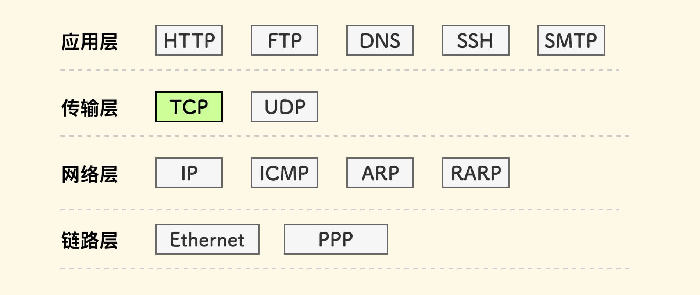
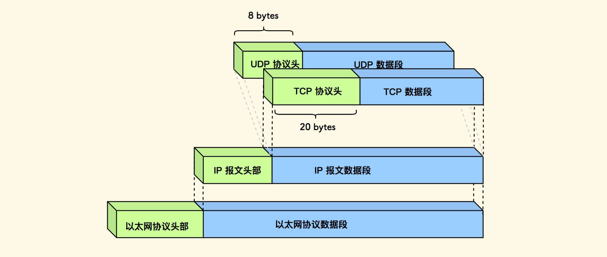
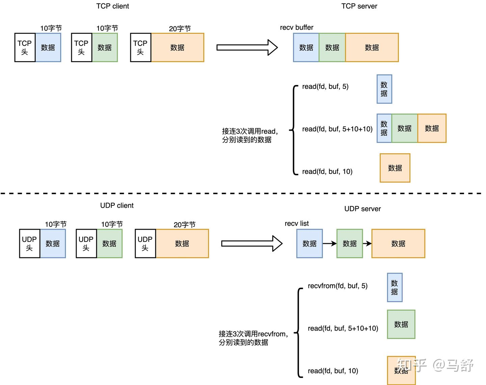
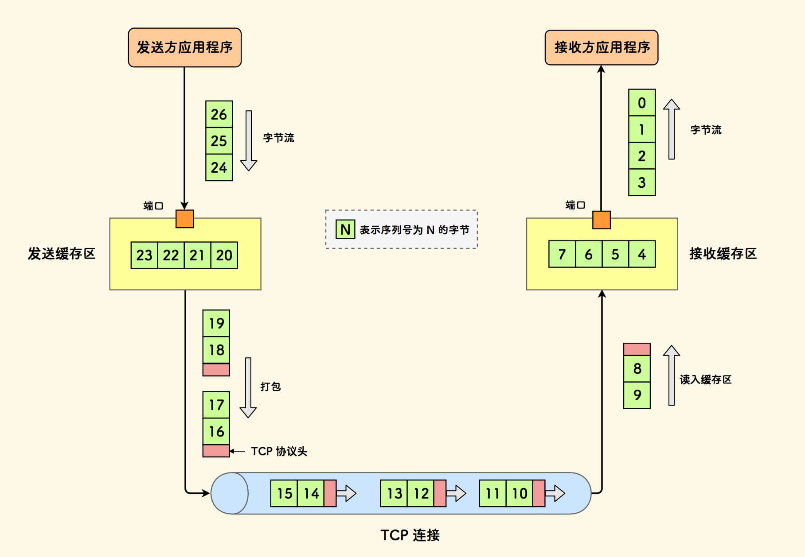
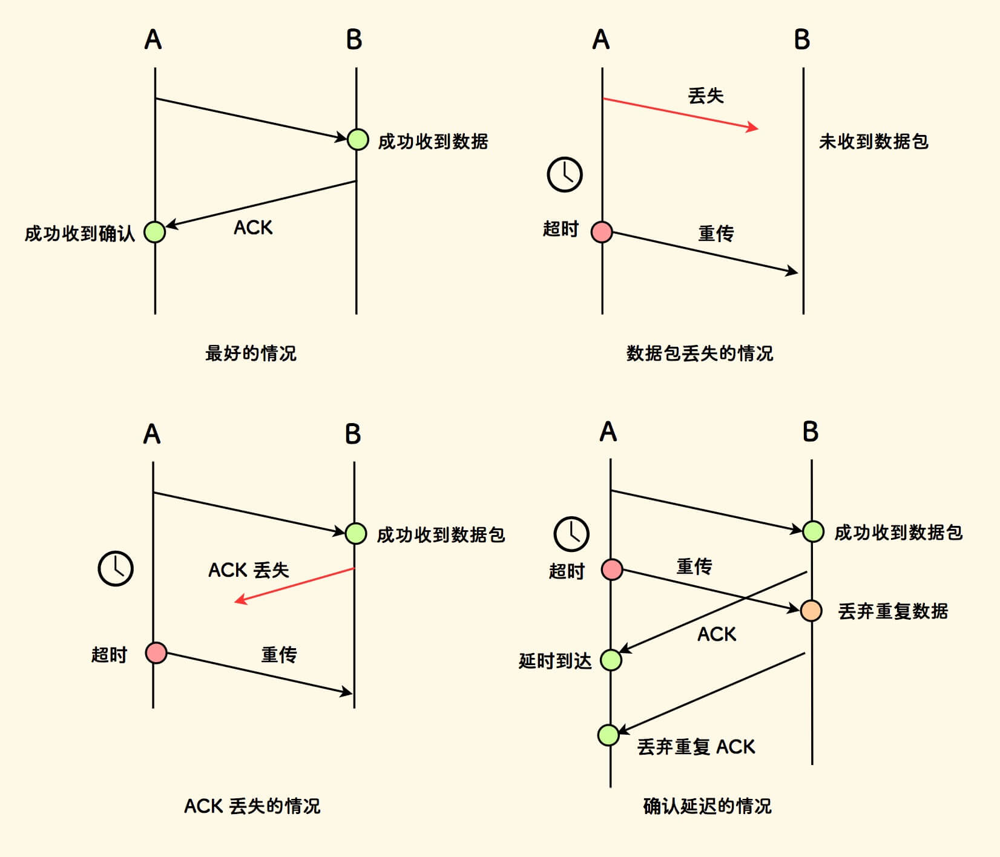
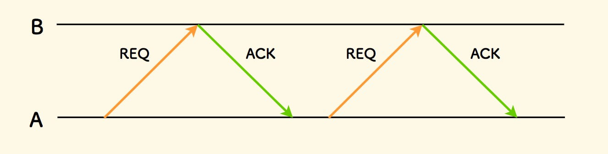
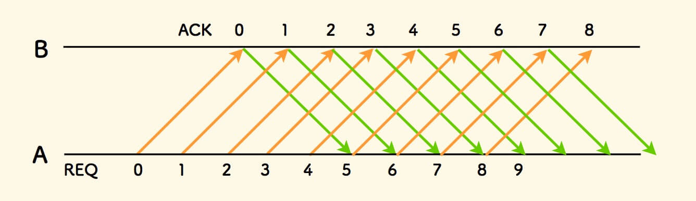
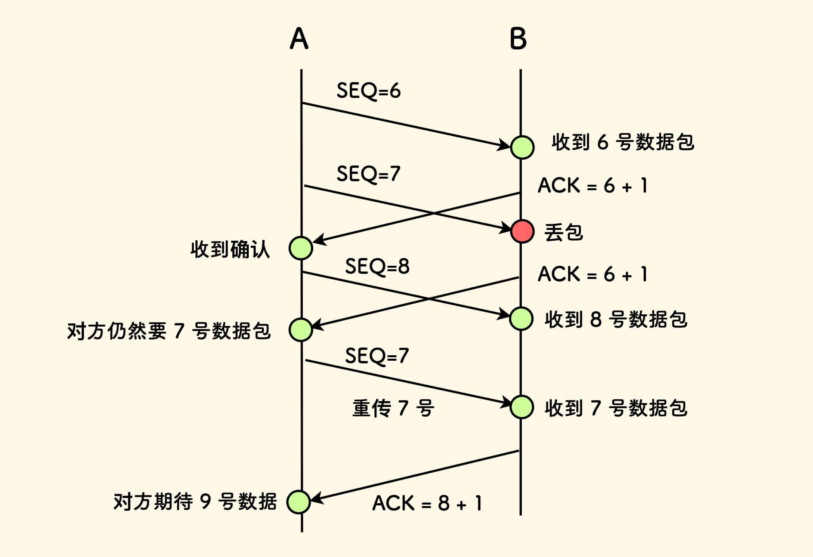
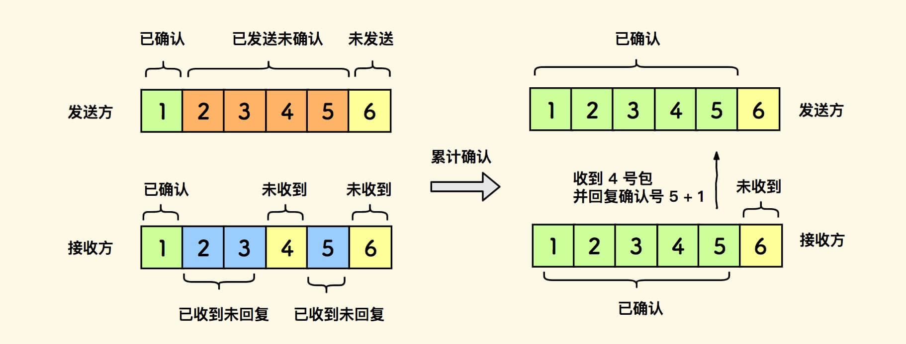
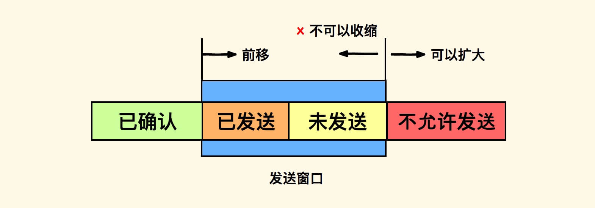

# tcp知识详解


## tcp的概念和特点


TCP协议全称传输控制协议， 是一种<font color="red">**面向连接的、可靠的、面向字节流的传输层通信协议**</font>。
TCP 在 TCP/IP 协议模型中位于**传输层**。

 

TCP/IP 模型中各层数据包结构的关系如下图。


 

TCP 协议的主要特点：

- 面向连接，一对一通信。
- 可靠交付：保序、不重复、不丢失。
- 全双工通信：双方均可收发。
- 和上层应用进程的交互方式是 面向字节流的。

**<font color="red">以下面向报文和面向字节流的内容不是重点，稍微看一下理解一下即可,如果发现无法理解的话，就直接把tcp面向字节流，udp面向报文这个结论背下来即可</font>**
```
PS: 与TCP面向字节流相对应的是UDP是面向报文的

从发送数据的角度来看它们之间的区别：
TCP是面向字节流的：发送方TCP对应用程序交下来的报文数据块，视为无结构的字节流（无边界约束，可拆分/合并），但维持各字节流顺序（相对顺序没有变），TCP发送方有一个发送缓冲区，当应用程序传输的数据块太长，TCP就可以把它划分短一些再分组传输，如果应用程序一次只传输一个字节，那么TCP可以等待积累足够多的字节后再构成报文端发送出去，所以TCP是面向字节的。

UDP是面向报文的：发送方的UDP对应用程序交下来的报文，在添加了首部之后就向下交付，UDP对应用层交付下来的报文即不合并也不拆分，而是保留这些报文的边界，应用层交给UDP多长的报文，UDP就照样发送，即一次发送一个报文，接收方UDP对下方交上来的UDP用户数据报，在去除首部之后就原封不动的交付给上层的应用程序，一次交付一个完整报文(但是网络层的IP协议是有可能分割报文的，但是至少在UDP在眼中它是完整地把报文扔给IP层的)，所以是UDP是面向报文的。

从接收数据的角度来看他们之间的区别：
每次调用recvfrom（理解为read就行）的时候

TCP：没有边界，怎么理解呢？就是上层也不知道我这次调用read，是读到了几个TCP数据包，可能是一个，半个，也可能是好几个。因此上层协议往往需要自己的边界来划分。

UDP：有边界。每次recvfrom，一定是读的一个UDP数据包，即使留的buffer太小没读全，下次recvfrom也是读下一个数据包，前一个数据包未读到的部分就丢了。

具体有关读的部分可以看下图理解。
```

 


TCP 和上层应用进程的交互方式：

- 发送方可以发送不同大小的数据块到发送缓存。
- 先会对发送缓存内的数据分段，打包成 TCP 数据包再发送。
- 在接收一侧，数据包会先进入接收缓存区。
- 当一定数量的数据包全部到达，重排、组装，以字节流方式吐给接收方。

 

虽然 TCP 是面向字节流的，但是TCP所处理的数据单元却是面向报文段的， 也就是本文所说的数据包。因为在进程的眼中，它并不是一个个字节地发给TCP缓冲区，而是一整个报文段发送给TCP缓冲区。只不过是TCP协议将缓冲区里的报文段内容按照字节的形式进行了分组，所以TCP是面向字节流的，但是在上层应用程序的眼中，它是一个个报文段同时发给TCP的。

## 可靠传输协议的实现机制

在这里先丢弃有关TCP的背景，先设想一下一个可靠的传输协议如何实现？

首先，由于丢包的可能性，要实现可靠通信：
- 发送方要知道对方接收成功，因此需要接收方回复确认即ACK。
如果丢包发生，发送方需要重传。
- 一种触发重传的方式是，超时重传(也有其他重传方法，例如下文会提到的快速重传)。

此外，无论往返中哪个包丢失或延迟，发送方认为对方没有收到，就会重传。


 

网络延时发生时，重传可能会导致重复：

- 接收方会丢弃收到的重复数据包，但是仍然回复确认。
- 发送方会丢弃收到的重复确认包。
其次，对于如何发送确认包和重传包，有两种方式。

### 停等协议

停等协议(又名:停止并等待 ARQ 协议)其实就是一问一答的方式，是指发送方等到接收方的确认包后，再发下一个数据包。

类似乒乓方式，具体来说：

1. 如果时限内收到对方确认，才发送下一个数据包。
2. 否则，重传当前数据包。

 

可以看到这种方式下，发送方大部分时间在等待，效率非常低。

### 流水线传输方式

流水线传输协议的学术名叫做**连续ARQ协议**,是指发送方会连续发送一组数据包，同时等待这些数据包的确认。

具体来说：
1. 发送方发送一批数据包。
2. 同步地接收对方的确认包。
简单来说，发送方不闲着，一边发送，一边等回复。

 

可以看到这种方式相对一问一答的方式，效率要高。

如果发生丢包或延时，需要重传，有两种方式：

**<font color="red">以下是重点，回退N重传就是PPT中的GBN(Go- Back-N)，选择重传就是SR(Selective Repeat)</font>**


- **<font color="red" size="10">务必看以下动画，比你看ppt要好理解多了</font>**
- 可以点击这个网站[**GBN和SR动画模拟**](https://www2.tkn.tu-berlin.de/teaching/rn/animations/gbn_sr/)看一下GBN和SR的动画模拟过程，一下子就懂了～！(maybe需要翻墙才能进去，vpn要先开了),看完动画之后再结合我下文的详解基本就能看懂了。这个动画的使用方法就是点击发送的数据包可以模拟丢包。

----
----

#### GBN协议详解

发送方每发送一个窗口的数据包，都会针对发送窗口最左端的数据包发起一个定时器(要有定时器才能知道哪个数据包超时了还没收到Ack回复)。**要注意这点和SR会有不同，在GBN中的定时器是一个窗口同时只有一个定时器，而SR理论上要针对每一个数据包维护一个定时器来计算是否超时**
一旦一个某个定时器触发，就会重传。
发送指针回退到未拿到确认的数据包处，以实现重传。

GBN协议中，发送窗口为K(K>=1),接收窗口为1(永远只接受下一个需要的包，不提前接收)。

对于接收方：
- 原则1: 如果有一个数据包(Seq=N)丢包的时候，那么在接收到Seq>N的数据包的时候都一直回复Ack=N并丢弃掉这些数据包(因为接收窗口的大小仅为1)，表明自己需要Seq=N这个数据包。
- 原则2: 接收方如果回复了Ack=K，则表明对于Seq<=K-1的数据包都已经全部有序接收到了
- 原则3: **在有的GBN协议的实现中，为了减少Ack包回复的次数，会启用累计确认**。例如收到了Seq=1，2，3的包，然后只回复了一个Ack=4，代表Seq<=3的包已经全部有序接收了，接下来需要Seq=4的数据包。所以做这方面的题目的时候如果题目说了启用累计确认的话要特别注意。<font color="red">需要注意的是动画中的GBN协议并没有使用累计确认(即它对每一个数据包都进行了Ack回复)的机制。但是一般来说GBN协议都会使用累计确认的机制，这个是动画做的不好。并且在动画中GBN的重传使用了累计发送的机制。就是将多个数据包集中在一个数据包，然后进行一次发送的机制。</font>


----

对于发送方：
- 原则1: 维护一个大小>=1的发送窗口。只有发送窗口最左端的数据报被发送且在定时器的计时范围内收到了相应的Ack包才进行发送窗口的右移。
- 原则2: 一个发送窗口只维护一个定时器，定时器只计算最左端的数据是否超时，如果最左端的数据超时。就进行整个发送窗口的数据重发。发送窗口每次右移就进行定时器的重置，重新统计最左端的数据是否超时。
- 原则3: 每次发送窗口进行右移之后会立刻发送当前窗口内未被发送的数据包。

----

- 对于接收方来说丢包的case:
- Seq为4，5，6，7的数据包被发送方发送了，接收方接到了4，5，7两个数据包。在接到数据包4的时候回复Ack=(表明自己需要下一个Seq为5的包)，在接到数据包5的时候回复Ack=6，**在接到Seq=7的包的时候，发现自己Seq=6的包缺失了，于是丢弃Seq=7的包并回复Ack=6**。

----

如果你看了那个动画的话就可以看到，对于每一个窗口，定时器都是只在计算第一个数据包是否超时，这是为了减少维护定时器的性能开销（计时对于CPU来说并不是一个轻松的工作）。

- 对于发送方来说超时的case:
- 这里的超时是指发送窗口的第一个数据包没有在定时器设置的时间内收到相应的Ack回复。
- 超时就是指发送窗口最左端的数据没有在规定时间内收到Ack回复，就进行整个发送窗口的数据包全部重发的操作。

----

- Question1：为什么要全部重发不能像SR协议一样只重发没有丢掉的包？
- Answer1：因为GBN协议一般来说都会使用累计确认机制减少Ack包的回复，但是这种机制导致丢包的时候不知道具体丢的是哪个包。所以需要发送窗口内的数据包要全部重传。这也是GBN的弊端：造成大量数据包的重复传递。

- Question2：为什么我看有的GBN协议会针对每一个数据包维护一个定时器？
- Answer2：题目出的不好，出题人没能完全理解GBN罢了。按照题目的意思做，不能硬刚。拿分最重要。

----
----


#### SR协议详解

SR协议和GBN不同，SR会针对每一个发送的数据包单独开一个定时器。一旦定时器超时则进行这个数据包的重发。

SR协议中，发送窗口为K(K>=1),接收窗口为M(M>=1)。**SR协议中没有要求接收窗口大小为1的限制**。

对于接收方：
- 原则1: 每接收到一个数据包都要回复Ack，例如数据包1，2，3，4，5种接收到1，2，3，5，则要进行Ack=1，2，3，5的四个Ack包的回复。而没有接收到的数据包则不进行回复。
- 原则2: 单个确认，逐一确认数据包是否被接收。这样才能让接收方知道哪些包是被接收了，哪些包没有。这样在重传的时候才能精确重传传丢的数据包。所以**SR协议不能使用普通的累计确认(但可以使用一些比较特殊的累计确认机制，下文会提到)**


----

对于发送方：
- 原则1: 维护一个大小>=1的发送窗口。只有发送窗口最左端的数据报被发送且在定时器的计时范围内收到了相应的Ack包才进行发送窗口的右移。**(这一点和GBN协议是一样的)**
- 原则2: 每一个数据包单独维护一个滑动窗口。

----

- 对于接收方来说丢包的case:
- Seq为4，5，6，7的数据包被发送方发送了，接收方接到了4，5，7两个数据包。在接到数据包4的时候回复Ack=5(表明自己需要下一个Seq为5的包)，在接到数据包5的时候回复Ack=6，**在接到Seq=7的包的时候，发现自己Seq=6的包缺失了，但是不管，直接回复Ack=7**。

----

- 对于发送方来说超时的case:
- 这里的超时是指任意一个数据包在规定时间范围内没有收到Ack
- 只重发发送窗口内超时的数据包。

----

- Question1：TCP使用的是不是SR协议？
- Answer1：其实SR协议不一定就一定优于GBN协议，因为SR协议其实是对于发送方来说数据包发少了，GBN协议是对于接收方来说Ack包发少了。**所以TCP使用的既不是SR协议，也不是GBN协议**，而是使用了一种基于这两种协议之上的一种滑动窗口机制。


## TCP滑动窗口机制

滑动窗口机制是 TCP 协议的精髓所在，它是 TCP 协议设计的基本框架 。

滑动窗口机制就是 流水线传输方式 在 TCP 协议中的细化设计， 发送方一边连续地发送数据包，一边等待接收方的确认。

滑动窗口分为两种：发送窗口 和 接收窗口。

**<font color="red">由于TCP是全双工的， 所以通信的每一端都会同时维护两种窗口</font>**。

```
最后一段红字的意思就是，对于tcp连接的双方，都可以做发送方/接收方，所以客户端和服务器端都要在本地维护发送窗口和接收窗口，所以一个tcp丽娜姐一共是有四个窗口（客户端的发送窗口和接收窗口，服务器端的发送窗口和接收端口）。
```
### TCP数据包序号

- 在可靠传输的基础机制中，接收的数据包可能是重复的、乱序的，因此 TCP 会对每一个数据包进行唯一标号，叫做数据包的序号。
- 每次发送一个包，这个序号就会增加一。
- 因为网络延时不可控， 如果两次连接建立时差很短、或者连接重建后老连接的数据包延迟到达，会造成序号冲突。
- 所以，序号并非由固定数字初始化。可以综合时间、随机数来生成等。


### 关于确认号Ack的理解

在 TCP 中，一个用以确认的回复包，会有确认号。如果一个数据包同时也是一个确认包，那么它也会有确认号。一个序号为 SEQ 的数据包，其确认包的确认号会是 SEQ+1 。

----

同样，确认号也是TCP协议头中的一个32比特大小的整数字段。<font color="red">**(随口一说的内容，不需要背tcp的协议头格式哈)**</font>

----

可以理解为，接收方已收到序号为Seq的数据包，期待发送方下一次给Seq+1的包。**但其实更准确的理解是，确认号是接收方期望对方发送的下一个包的序号**。但是如果在中间某个丢包的情况下，接收方期待发送方的下一次给的包就不一定是Seq+1了。

下图中，发送方连续发送一组包，如果中间有丢包，**接收方则期待序号最小的丢失的包**。当重传成功后，接收方仍然期待下一个未拿到的数据包。

 

### 关于累计确认的理解

接收方确认了标号为Seq=x的数据包，即代表确认了所有小于Seq<=x的数据包， 此时接收方给的确认号是Ack=x+1。如下图所示，当2，3，4，5都收到的时候，只回复一个Ack=5+1=6，这样4个确认包就减少到1个了。

 

累计确认其实是一种批量确认的机制，以减少确认包的数量。此外，如果接收方恰好需要发送数据，确认号可以直接标在数据包上，即捎带确认。(最好的例子就是三次握手中的第二次握手，因为刚好要发送Seq,又要确认接收到了上一次的Seq，于是就把Seq序号和Ack确认号一起发出去了)。

实际上，在累计确认的实现中，还会设置一个时间阈值，如果超过了这个时间阈值仍然没有新的数据包到来，则对当前收到的最新的数据包进行一次确认。

### 关于累计发送的理解

和累计确认一样，未发送的包达到一定量、或者达到一个时间阈值，才发送一次。

### 发送窗口

和前文提到过的发送窗口是一样的，窗口最左端的数据包就向右滑，注意的是 窗口大小是有限的（稍后将讨论它的受限情况）， 发送方只能发送窗口内的数据包 。

### 接收窗口

和发送窗口类似，接收到了最左端的数据包并确认了数据包并且把数据包往应用程序传了之后就往右滑。

仍需注意窗口大小是有限的（稍后将讨论它的受限情况，接收方只能接收窗口内的数据包。

**由于网络数据包是乱序的，所以接收后的数据包会按照序号重新排序，才可以交付给应用程序。**

### <font color="Orange">**窗口大小(重点，重点，重点！！！)**</font>

<font color="red">**重点1**</font>
- 流量控制的定义：**由接收方控制的、调节发送方生产速度的机制**，其具体的实现方式，就是在回复时设置TCP协议头中的窗口大小字段。

<font color="red">**重点2**</font>

窗口的大小也是动态变化的， 因为两端接收和发送能力是动态变化的：

**这两句话不用死记硬背，理解性记忆**
1. 接收能力的变化导致窗口大小的变化，即后面所讲的TCP流量控制机制。
2. 发送能力的变化导致窗口大小的变化，即后面所讲的TCP拥塞控制机制。


<font color="red">**重点3**</font>

如果窗口要缩小，窗口的前沿是不可以向左收缩的。
窗口收缩的方法则是，慢慢地，随着已发送的数据包得到确认，保持窗口前沿不动，前移窗口后沿。

----

因此， 发送窗口也并不总和接收窗口一样大。
窗口大小的初始化，是在连接建立过程中两端协商确定的， 在后续的传输阶段，它会因主动或被动的原因而动态变化。

 


