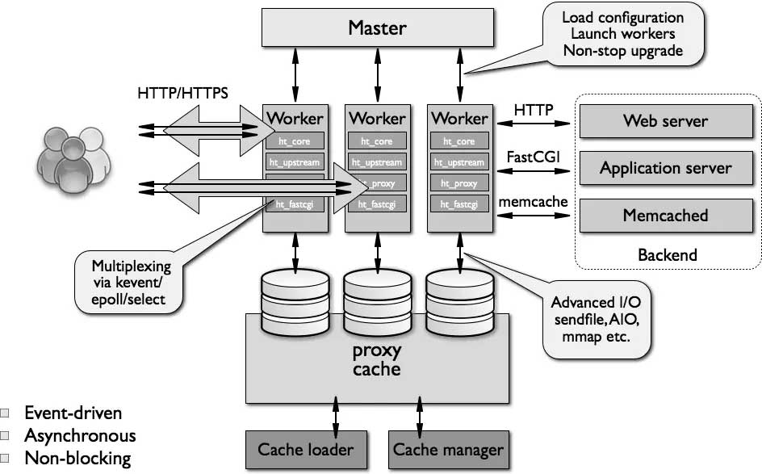
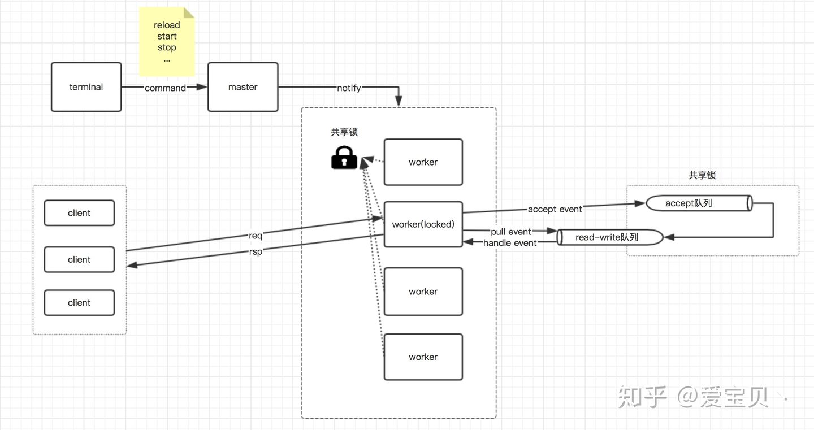

<!--
 * @Author: uestc.zyj@gmail.com
 * @Date: 2021-09-23 09:29:07
 * @LastEditTime: 2021-09-26 09:10:01
 * @Description: nginx interview questions
 * @FilePath: /interviews/nginx/nginx.md
-->


1. nginx的作用

在Web开发中，通常来说，动态资源其实就是指那些后台资源，而静态资源就是指HTML，JavaScript，CSS，img等文件。一般来说，都需要将动态资源和静态资源分开，将静态资源部署在Nginx上，当一个请求来的时候，如果是静态资源的请求，就直接到nginx配置的静态资源目录下面获取资源，如果是动态资源的请求，nginx利用反向代理的原理，把请求转发给后台应用去处理，从而实现动静分离。在使用前后端分离之后，可以很大程度的提升静态资源的访问速度，同时在开过程中也可以让前后端开发并行可以有效的提高开发时间，也可以有些的减少联调时间

- http服务器，nginx可以独立提供http服务，可以做网页的静态服务器
- 虚拟主机。通过一台服务器虚拟出多个网站（只要ip地址：端口号这个元组不同，就可以通过nginx虚拟多个网站）。
- 反向代理，负载均衡。可以使用nginx将请求合理均匀地分发到多个服务器
- nginx 中也可以配置安全管理、比如可以使用Nginx搭建API接口网关,对每个接口服务进行拦截。

优点：
1.占内存小，可实现高并发连接，处理响应快
2.可实现http服务器、虚拟主机、方向代理、负载均衡
3.Nginx配置简单
4.可以不暴露正式的服务器IP地址

缺点：
动态处理差：nginx处理静态文件好,耗费内存少，但是处理动态页面则很鸡肋（动态页面需要后台服务器动态生成html），**所以现在一般前端用nginx作为反向代理抗住压力**

2. nginx的配置

```
...              #全局块

events {         #events块
   ...
}

http      #http块
{
    ...   #http全局块
    server        #server块
    {
        ...       #server全局块
        location [PATTERN]   #location块
        {
            ...
        }
        location [PATTERN]
        {
            ...
        }
    }
    server
    {
      ...
    }
    ...     #http全局块
}
```

第一部分 全局块
主要设置一些影响 nginx 服务器整体运行的配置指令。  比如： worker_processes 1; ， worker_processes 值越大，可以支持的并发处理量就越多。
第二部分 events块
events 块涉及的指令主要影响Nginx服务器与用户的网络连接。  比如： worker_connections 1024; ，支持的最大连接数。
第三部分 http块
http 块又包括 http 全局块和 server 块，是服务器配置中最频繁的部分，包括配置代理、缓存、日志定义等绝大多数功能。server块：配置虚拟主机的相关参数。location块：配置请求路由，以及各种页面的处理情况。

sample:
```
########### 每个指令必须有分号结束。#################
#user administrator administrators;  #配置用户或者组，默认为nobody nobody。
#worker_processes 2;  #允许生成的进程数，默认为1
#pid /nginx/pid/nginx.pid;   #指定nginx进程运行文件存放地址
error_log log/error.log debug;  #制定日志路径，级别。这个设置可以放入全局块，http块，server块，级别以此为：debug|info|notice|warn|error|crit|alert|emerg
events {
    accept_mutex on;   #设置网路连接序列化，防止惊群现象发生，默认为on
    multi_accept on;  #设置一个进程是否同时接受多个网络连接，默认为off
    #use epoll;      #事件驱动模型，select|poll|kqueue|epoll|resig|/dev/poll|eventport
    worker_connections  1024;    #最大连接数，默认为512
}
http {
    include       mime.types;   #文件扩展名与文件类型映射表
    default_type  application/octet-stream; #默认文件类型，默认为text/plain
    #access_log off; #取消服务日志
    log_format myFormat '$remote_addr–$remote_user [$time_local] $request $status $body_bytes_sent $http_referer $http_user_agent $http_x_forwarded_for'; #自定义格式
    access_log log/access.log myFormat;  #combined为日志格式的默认值
    sendfile on;   #允许sendfile方式传输文件，默认为off，可以在http块，server块，location块。
    sendfile_max_chunk 100k;  #每个进程每次调用传输数量不能大于设定的值，默认为0，即不设上限。
    keepalive_timeout 65;  #连接超时时间，默认为75s，可以在http，server，location块。

    upstream mysvr {
      server 127.0.0.1:7878;
      server 192.168.10.121:3333 backup;  #热备
    }
    error_page 404 https://www.baidu.com; #错误页
    server {
        keepalive_requests 120; #单连接请求上限次数。
        listen       4545;   #监听端口
        server_name  127.0.0.1;   #监听地址
        location  ~*^.+$ {       #请求的url过滤，正则匹配，~为区分大小写，~*为不区分大小写。
           #root path;  #根目录
           #index vv.html;  #设置默认页
           proxy_pass  http://mysvr;  #请求转向mysvr 定义的服务器列表
           deny 127.0.0.1;  #拒绝的ip
           allow 172.18.5.54; #允许的ip
        }
    }
}
```

3. nginx的原理实现

 

1）master 进程并不处理网络请求，主要负责调度工作进程：加载配置、启动工作进程、非停升级（reload）

2）worker 进程负责处理网络请求与响应，在类 unix 系统上，Nginx 可以配置多个 worker，而每个 worker 进程都可以同时处理 数以千计的网络请求 （一般来说只需要worker数量与cpu核心数量相同即可）

3）proxycache用于存储查询频繁但不需要实时更新的数据


master进程主要用来管理worker进程，具体包括如下4个主要功能：
1）接收来自外界的信号，包含客户端、服务端、控制端。
2）向各worker进程发送信号。
3）监控woker进程的运行状态。
4）当woker进程退出后（异常情况下），会自动重新启动新的woker进程。

woker进程主要用来处理基本的网络事件：
1）多个worker进程之间是对等且相互独立的，他们同等竞争来自客户端的请求。
2）一个请求，只可能在一个worker进程中处理，一个worker进程，不可能处理其它进程的请求。
3）worker进程的个数是可以设置的，一般会设置进程数量与机器cpu核数一致。
4）nginx为了更好的利用多核特性，具有cpu绑定选项，可以将某一个进程绑定在某一个核上，这样就不会因为进程的切换带来cache的失效。

 

master进程通过接收客户端的请求，比如-s reload、-s stop等，解析这些命令之后，通过进程间通信，将相应的指令发送到各个worker进程，从而实现对worker进程的控制；
**每个worker进程都会竞争同一个共享锁，只有竞争到共享锁的进程才能够处理客户端请求；**
当客户端请求发送过来之后，worker进程会处理该请求的事件，如果是accept事件，则会将其添加到accept队列中，如果是read或者write事件，则会将其添加到read-write队列中；
在将事件添加到相应的队列中之后，**在持有共享锁的情况下，nginx会处理完accept队列中的客户端连接请求**，而对于read或者write事件，则会在释放锁之后直接从read-write队列中取出事件来处理。

也就是说竞争共享锁之后只会抢占accept事件，然后获取套接字。之后的read/write放在每个worker独有的一个队列中，在不持有锁的时候就从队列中通过epoll取出事件进行处理。

4. 为什么nginx使用多进程而不使用多线程？
1）进程之间不共享资源，不需要加锁，减少了使用锁对性能造成的影响，同时降低编程的复杂度，降低开发成本。
2）采用独立的进程，可以让进程互相之间不会影响，如果一个进程发生异常退出时，其它进程正常工作，
3）master 进程则很快启动新的 worker 进程，确保服务不会中断，从而将风险降到最低。

5. 内存池
为了避免出现内存碎片，减少向操作系统申请内存的次数、降低各个模块的开发复杂度，Nginx 设计了简单的内存池，
它的作用主要是把多次向系统申请内存的操作整合成一次，这大大减少了 CPU 资源的消耗，同时减少了内存碎片。
**因此，通常每一个请求都有一个简易的独立内存池（如每个 TCP 连接都分配了一个内存池），而在请求结束时则会销毁整个内存池，把曾经分配的内存一次性归还给操作系统。**这种设计大大提高了模块开发的简单些，因为在模块申请内存后不用关心它的释放问题；而且因为分配内存次数的减少使得请求执行的时延得到了降低。
同时，通过减少内存碎片，提高了内存的有效利用率和系统可处理的并发连接数，从而增强了网络性能。


6. nginx的进程处理模型

nginx 服务器使用 master/worker 多进程模式。多线程启动和执行的流程如下：
1）主程序 Master process 启动后，通过一个 for 循环来 接收 和 处理外部信号；
2）主进程 通过 fork() 函数产生 worker 子进程，每个子进程 执行一个 for 循环来实现 Nginx 服务器 对事件的接收和处理。


7. nginx的进程间通信

由于master进程和worker进程是父子进程关系，所以适合使用匿名管道进行通信。
worker进程之间是相互隔离的，需要通信的话只能通过master进程间接实现。
