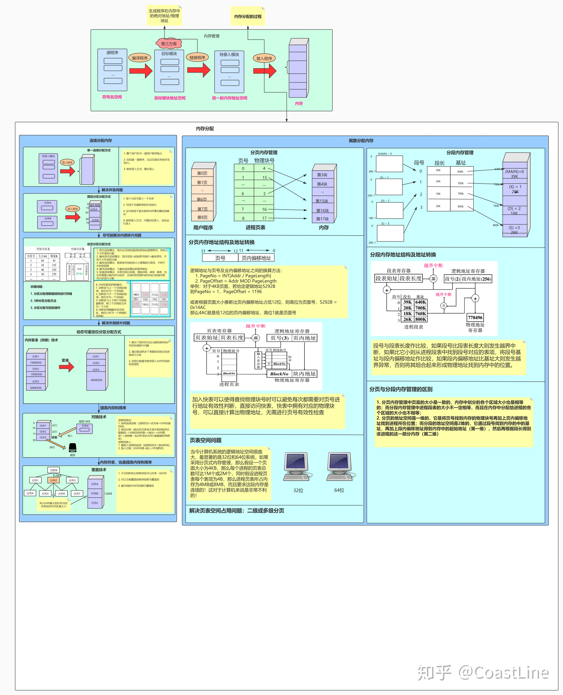

<!--
 * @Author: uestc.zyj@gmail.com
 * @Date: 2021-09-21 16:40:02
 * @LastEditors: Please set LastEditors
 * @Description: os interview questions
 * @FilePath: /interviews/os/os.md
-->

# 操作系统八股文

## 1.进程与线程

### 1.1 Linux系统中进程的存放结构
内核把进程的列表存放在叫做任务队列(task list)的双向循环链表中。链表中的每一项都是类型为task_struct(**这其实就是Linux的PCB，进程控制块**)、称为进程描述符的结构,该结构定义在<linux/sched.h>文件中。进程描述符中包含一个具体进程的所有信息。
task_struct相对较大,在32位机器上,它大约有1.7KB,但如果考虑到该结构内包含了内核管理一个进程所需的所有信息,那么它的大小也算相当小了。进程描述符中包含的数据能完整地描述一个正在执行的程序:它打开的文件,进程的地址空间,挂起的信号,进程的状态等。
调度就是将某个task_struct的状态切换到运行态。将结构体的state域的值覆盖。

### 1.2 对于进程的基本理解

进程就是运行中的程序（CPU上下文，静态代码区，持有的寄存器，程序计数器等所有环境的总和）。

### 1.3 进程上下文切换

切换虚拟地址空间，切换内核栈和硬件上下文，CPU高速缓存失效、进程CPU环境(栈、寄存器、页表和文件句柄等)。

**可以从以下方面理解进程的上下文包含内容：**

（1）用户级上下文: 正文、数据、用户堆栈以及共享存储区；

（2）寄存器上下文: 通用寄存器、程序寄存器(IP)、处理器状态寄存器(EFLAGS)、栈指针(ESP)；

（3）系统级上下文: 进程控制块task_struct、内存管理信息(mm_struct、vm_area_struct、pgd、pte)、内核栈。

### 1.4 进程的状态

运行态，运行态指的就是进程实际占用 CPU 时间片运行时

就绪态，就绪态指的是可运行，但因为其他进程正在运行而处于就绪状态

阻塞态，除非某种外部事件发生，否则进程不能运行

要注意好这三种状态间的相互转换逻辑

### 1.5 对于线程的基本理解

在Linux下其实本并没有线程，只是为了迎合开发者口味，搞了个轻量级进程出来就叫做了线程。轻量级进程和进程一样，都有自己独立的task_struct进程描述符，也都有自己独立的pid。从操作系统视角看，调度上和进程没有什么区别，都是在等待队列的双向链表里选择一个task_struct切到运行态而已。只不过轻量级进程和普通进程的区别是可以共享同一内存地址空间、代码段、全局变量、同一打开文件集合而已。

### 1.6 线程上下文切换

和进程类似，不过由于同一个进程的多个线程共享一个虚拟地址，用户级上下文等上下文，所以线程的上下文的切换的开销没有那么大。（但是需要注意的是每个线程独占一个线程栈）

C库中的pthread实现的是1:1的线程模型，可以视作内核级线程。

### 1.7 进程进行fork之后copy-on-write的过程
在fork之后exec之前两个进程用的是相同的物理空间（内存区），子进程的代码段、数据段、堆栈都是指向父进程的物理空间，也就是说，两者的虚拟空间不同，但其对应的物理空间是同一个。
当父子进程中有更改相应段的行为发生时，再为子进程相应的段分配物理空间。
如果不是因为exec，内核会给子进程的数据段、堆栈段分配相应的物理空间（至此两者有各自的进程空间，互不影响），而代码段继续共享父进程的物理空间（两者的代码完全相同）。
而如果是因为exec，由于两者执行的代码不同，子进程的代码段也会分配单独的物理空间。
fork()之后，kernel把父进程中所有的内存页的权限都设为read-only，然后子进程的地址空间指向父进程。当父子进程都只读内存时，相安无事。当其中某个进程写内存时，CPU硬件检测到内存页是read-only的，于是触发页异常中断（page-fault），陷入kernel的一个中断例程。中断例程中，kernel就会把触发的异常的页复制一份，于是父子进程各自持有独立的一份。

### 1.7 进程间进行通信的方式

1.7.1 匿名管道通信

匿名管道( pipe )：管道是一种半双工的通信方式，数据只能单向流动，而且只能在具有亲缘关系的进程间使用。进程的亲缘关系通常是指父子进程关系。本质是内核缓冲区的一段内存

通过匿名管道实现进程间通信的步骤如下：
- 父进程创建管道，得到两个⽂件描述符指向管道的两端
- 父进程fork出子进程，⼦进程也有两个⽂件描述符指向同⼀管道。
- 父进程关闭fd[0],子进程关闭fd[1]，即⽗进程关闭管道读端,⼦进程关闭管道写端（因为管道只支持单向通信）。(其实不关闭也可以作为双工通信，但是这样子写出来的程序bug太多了)
- ⽗进程可以往管道⾥写,⼦进程可以从管道⾥读,管道是⽤环形队列实现的,数据从写端流⼊从读端流出,这样就实现了进程间通信。

命名管道是以磁盘文件形式存在，可以实现任意两个进程的通信

1.7.2 socket通信

1.7.3 共享内存

1.7.4 信号，例如终端发送信号给正在运行的进程导致强制结束。

1.7.5 信号量，只能用来同步，不能实现复杂信息

1.7.6 消息队列

### 1.8 进程/线程同步的方式

临界区，互斥量，信号量，事件

## 2. 内存管理

### 2.1 分页内存管理

把内存空间划分为大小相等且固定的块，作为主存的基本单位。因为程序数据存储在不同的页面中，而页面又离散的分布在内存中，因此需要一个页表来记录映射关系，以实现从页号到物理块号的映射。

访问分页系统中内存数据需要两次的内存访问 (一次是从内存中访问页表，从中找到指定的物理块号，加上页内偏移得到实际物理地址；第二次就是根据第一次得到的物理地址访问内存取出数据)。

从逻辑地址到物理地址的映射是，逻辑地址mod页面大小的结果为页号，页号对应的块号*页面大小+页内偏移（页内偏移是逻辑地址/页面大小的余数），需要两次访存。

### 2.2 分段内存管理

分页是为了提高内存利用率，而分段是为了满足程序员在编写代码的时候的一些逻辑需求(比如数据共享，数据保护，动态链接等)。

分段内存管理当中，地址是二维的，一维是段号，二维是段内地址；其中每个段的长度是不一样的，而且每个段内部都是从0开始编址的。由于分段管理中，每个段内部是连续内存分配，但是段和段之间是离散分配的，因此也存在一个逻辑地址到物理地址的映射关系，相应的就是段表机制。

 .

### 2.3 swap

操作系统把物理内存(physical RAM)分成一块一块的小内存，每一块内存被称为页(page)。当内存资源不足时，Linux把某些页的内容转移至硬盘上的一块空间上，以释放内存空间。硬盘上的那块空间叫做交换空间(swap space),而这一过程被称为交换(swapping)。物理内存和交换空间的总容量就是虚拟内存的可用容量。

用途：

物理内存不足时一些不常用的页可以被交换出去，腾给系统。
程序启动时很多内存页被用来初始化，之后便不再需要，可以交换出去。

### 2.4 页面替换算法
LRU，LFU，FIFO，OPT等

### 2.5 内存分配算法
最先适应，循环最先适应，最佳适应，最差适应，快速适应

### 2.6 虚拟内存

虚拟内存 使得应用程序认为它拥有连续的可用的内存（一个连续完整的地址空间），而实际上，它通常是被分隔成多个物理内存碎片，还有部分暂时存储在外部磁盘存储器上，在需要时进行数据交换。

现代处理器使用的是一种称为 虚拟寻址(Virtual Addressing) 的寻址方式。使用虚拟寻址，CPU需要将虚拟地址翻译成物理地址，这样才能访问到真实的物理内存。 实际上完成虚拟地址转换为物理地址转换的硬件是 CPU 中含有一个被称为 内存管理单元（Memory Management Unit, MMU）的硬件。MMU 需要借助存放在内存中的页表来动态翻译虚拟地址，该页表由操作系统管理。

通过虚拟地址访问内存有以下优势：

程序可以使用一系列相邻的虚拟地址来访问物理内存中不相邻的大内存缓冲区。
程序可以使用一系列虚拟地址来访问大于可用物理内存的内存缓冲区。当物理内存的供应量变小时，内存管理器会将物理内存页（通常大小为 4 KB）保存到磁盘文件。数据或代码页会根据需要在物理内存与磁盘之间移动。
不同进程使用的虚拟地址彼此隔离。一个进程中的代码无法更改正在由另一进程或操作系统使用的物理内存。

### 2.7 Unix IO模型

对于一次IO访问（以read举例），数据会先被拷贝到操作系统内核的缓冲区中，然后才会从操作系统内核的缓冲区拷贝到应用程序的地址空间。所以说，当一个read操作发生时，它会经历两个阶段：

等待数据准备就绪 (Waiting for the data to be ready)
将数据从内核拷贝到进程中 (Copying the data from the kernel to the process)
正式因为这两个阶段，linux系统产生了下面五种网络模式的方案：

阻塞式IO模型(blocking IO model)
非阻塞式IO模型(noblocking IO model)
IO复用式IO模型(IO multiplexing model)
信号驱动式IO模型(signal-driven IO model)
异步IO式IO模型(asynchronous IO model)

其中，IO多路复用模型指的是：使用单个进程同时处理多个网络连接IO，他的原理就是select、poll、epoll 不断轮询所负责的所有 socket，当某个socket有数据到达了，就通知用户进程。该模型的优势并不是对于单个连接能处理得更快，而是在于能处理更多的连接。

（1）select：时间复杂度 O(n)

select 仅仅知道有 I/O 事件发生，但并不知道是哪几个流，所以只能无差别轮询所有流，找出能读出数据或者写入数据的流，并对其进行操作。所以 select 具有 O(n) 的无差别轮询复杂度，同时处理的流越多，无差别轮询时间就越长。

（2）poll：时间复杂度 O(n)

poll 本质上和 select 没有区别，它将用户传入的数组拷贝到内核空间，然后查询每个 fd 对应的设备状态， 但是它没有最大连接数的限制，原因是它是基于链表来存储的。

（3）epoll：时间复杂度 O(1)

epoll 可以理解为 event poll，不同于忙轮询和无差别轮询，epoll 会把哪个流发生了怎样的 I/O 事件通知我们。所以说 epoll 实际上是事件驱动（每个事件关联上 fd）的。epoll的时候会采用类似于callback回调的机制。当IO完成后激活某个文件描述符，当调用epoll_wait()返回就绪的文件描述符。

select，poll，epoll 都是 IO 多路复用的机制。I/O 多路复用就是通过一种机制监视多个描述符，一旦某个描述符就绪（一般是读就绪或者写就绪），就通知程序进行相应的读写操作。但 select，poll，epoll 本质上都是同步 I/O，因为他们都需要在读写事件就绪后自己负责进行读写，也就是说这个读写过程是阻塞的，而异步 I/O 则无需自己负责进行读写，异步 I/O 的实现会负责把数据从内核拷贝到用户空间。

### 2.8 多线程和IO多路复用的优劣？

如果使用的是select和poll实现的io多路复用，则时间复杂度为O(n)，在性能上没有优越性。
如果是epoll实现的io多路复用，则性能的理论上限大于多线程。因为epoll是基于同一个cpu上下文的o（1）的事件驱动的io多路复用，不需要过多地切换cpu上下文以及没有给线程分配线程的私有栈区和寄存器的开销。
不过在现实中的应用一般是在多核心cpu上使用多线程，每个处理核心一个线程避免上下文切换，并且在每个线程上使用io多路复用（例如nginx就是多进程+io多路复用的混合架构）。

io多路复用适合 逻辑处理的时间 << io时间的场景
多线程适合 逻辑处理时间 相对于 io时间已经不能忽略的场景 （如果是在cpu密集型的应用中使用io多路复用，会导致任务队列排在后头的任务要很久才能得到响应）
