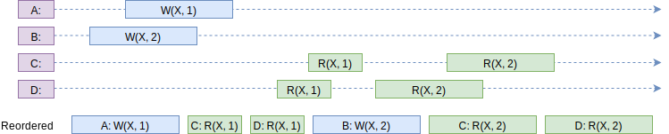
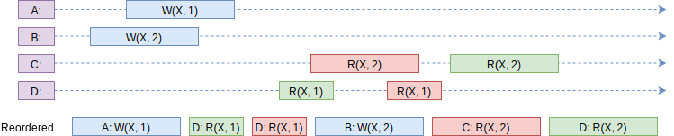
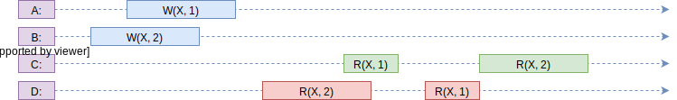
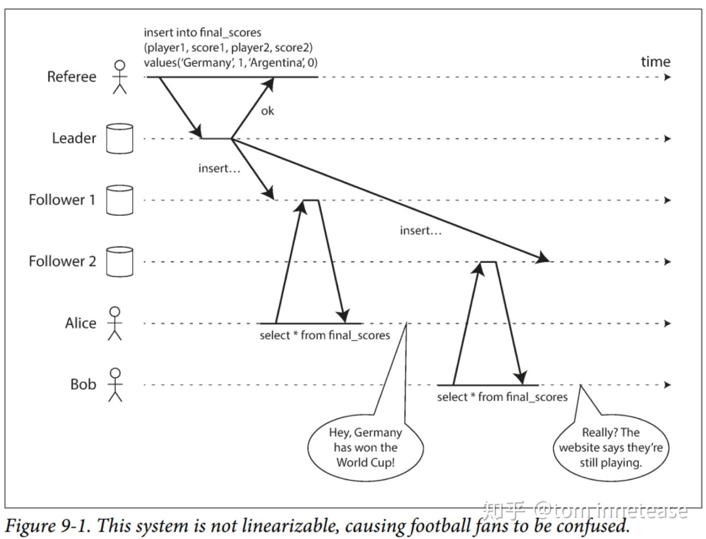

<!--
 * @Author: uestc.zyj@gmail.com
 * @Date: 2021-09-23 13:37:00
 * @LastEditTime: 2021-09-25 21:24:00
 * @Description: raft interview questions
 * @FilePath: /interviews/raft/raft.md
-->


# Raft面经

## 1. 如何理解顺序一致性和线性一致性？

### 1.1 顺序一致性

顺序一致性就是简单地进行理解就是拥有A，B，C，D……等多个运行进程，每个运行进程有着自己的逻辑运行顺序，

例如
```
A：action1 -> action2 -> action3
B: action4-> action5 -> action6
```

action1到action6要至少存在一个合理的顺序，令A，B执行action的相对逻辑顺序正确且结果正确（不关心不同进程间的执行顺序，只要求单个进程内的顺序一致）。比较难以理解，直接上图bb

 .

就像上图一样，可以找出一个合理的顺序，令所有单个进程内所有指令的执行都能得到正确的结果。
按照Reordered这个顺序，D确实可以先读到x=1，再读到x=2，c也可以先读到x=1，再读到x=2。每个进程内部的执行顺序和执行结果都是正确的。
但是此处有一个问题，就是B的写x=2这条指令应该是在A的写x=1之前，但是这个顺序却将B的写指令放在A的写指令之后，这是不是不正确呢？
**此处需要注意的是，顺序一致性不关心进程之间的指令执行顺序！所以A先写还是B先写不影响顺序一致性的达成，只需要单个进程内逻辑顺序满足且结果正确就行**

 .

同理上图也是可以符合顺序一致性的。

 .

上图就不可以了，因为D的顺序是先读到2再读到1，C的顺序是先读到1再读到2，这样的话是不可能找到一个指令执行顺序满足进程内逻辑顺序和结果的。


### 1.2 线性一致性

线性一致性其实就是在顺序一致性的基础上增加了一个更为严格的要求：**增加一个全局时钟记录各个进程执行各个时间，对多个进程之间的命令执行顺序有要求**

 .

上图就是一个典型的非线性一致的情景。用户insert了一条数据，并且已经返回了ok，看作该事件已经结束了。这个事件结束了之后 alice和bob却因为follower同步时间不一致的情况而导致select到了不一样的结果，这就是典型的线性不一致的情景。

**而这个情景是符合顺序一致性的，因为可以找到一个存在的顺序令进程内逻辑顺序一致：bob读，referee写，alice读**

### 1.3 Raft如何保证线性一致性？

#### 1.3.1 Raft不能保证线性一致性的场景

- 比如发生网络分区，旧leader处于少数派分区中，且刚好在heartbeat时间内没能发现leadership丢失，如果此时直接从旧leader的状态机读，则很可能返回stale的结果。假设新leader已被选举出来且提交了新的记录，此时有两个客户端分别从新旧leader读取，从新leader能读取到新记录，旧leader只能读取到旧记录，从整个系统的角度看违背了线性一致性。**这一点可以通过设置心跳包失败超时来解决，如果发送心跳包没有得到回应，则重传，设定一个重传次数，达到一定次数后则自动放弃leader地位**
- raft并不限定在propose结果返回给调用方前必须提交到状态机，很可能会出现这样的情况：commitIndex包含了之前propose的记录，但状态机applyIndex还小于commitIndex，即还没来得及提交到状态机。为了保证先写后读的可见性问题，一旦写入时承诺了某个commitIndex，**下次读取的时候需要等到applyIndex大于等于该Index（或者后续某个commitIndex，因为是单调递增的）才能返回，这样才能确保线性一致性。**


#### 1.3.2 Raft保证线性一致性的方法

1. **Read as Proposal**
   raft只有写操作才乎走一次raft流程，要保证读写的线性一致性，可以在读操作时也走一次raft流程。在论文的raft实现中是没有读日志这种操作的。可以实现一个读日志，然后只有该日志应用在状态机中时进行对客户端的响应。因为先写后读，读日志被应用了，写日志也一定被应用到状态机中了。
2. **ReadIndex**
   这种处理方法省掉了额外的IO，leader在发起读时记录当前的commitIndex，然后在后续heartbeat请求中如果能获得多数派对leadership的确认（为了防止1.3.1中提到的网络分区的情况），那么可以等待commitIndex提交到状态机后即可返回结果。


## 2. 如何理解Raft的步骤？

### 2.1 基础概念

Raft 通过选举一个领导人，然后给予他全部的管理复制日志的责任来实现一致性。领导人从客户端接收日志条目(log entries)，把日志条目复制到其他服务器上，并且当保证安全性的时候告诉其他的服务器应用日志条目到他们的状态机中。拥有一个领导人大大简化了对复制日志的管理。例如，领导人可以决定新的日志条目需要放在日志中的什么位置而不需要和其他服务器商议，并且数据都从领导人流向其他服务器。一个领导人可能会宕机，或者和其他服务器失去连接，在这种情况下一个新的领导人会被选举出来。

通过领导人的方式，Raft 将一致性问题分解成了三个相对独立的子问题，这些问题会在接下来的子章节中进行讨论：

* **领导选举**：当现存的领导人宕机的时候, 一个新的领导人需要被选举出来（章节 5.2）
* **日志复制**：领导人必须从客户端接收日志条目(log entries)然后复制到集群中的其他节点，并且强制要求其他节点的日志保持和自己相同。
* **安全性**：在 Raft 中安全性的关键是在状态机安全：如果有任何的服务器节点已经应用了一个确定的日志条目到它的状态机中，那么其他服务器节点不能在同一个日志索引位置应用一个不同的指令。


**状态**：

所有服务器上的持久性状态
(在响应RPC请求之前 已经更新到了稳定的存储设备)
| 参数 | 解释 |
| --- | --- |
| currentTerm | 服务器已知最新的任期（在服务器首次启动的时候初始化为0，单调递增）|
| votedFor | 当前任期内收到选票的候选者id 如果没有投给任何候选者 则为空|
| log[] | 日志条目;每个条目包含了用于状态机的命令，以及领导者接收到该条目时的任期（第一个索引为1） |

所有服务器上的易失性状态
| 参数 | 解释 |
| --- | --- |
| commitIndex | 已知已提交的最高的日志条目的索引（初始值为0，单调递增）|
| lastApplied | 已经被应用到状态机的最高的日志条目的索引（初始值为0，单调递增）|

领导者（服务器）上的易失性状态
(选举后已经重新初始化)
| 参数 | 解释 |
| --- | --- |
| nextIndex[] | 对于每一台服务器，发送到该服务器的下一个日志条目的索引（初始值为领导者最后的日志条目的索引+1）|
| matchIndex[] | 对于每一台服务器，已知的已经复制到该服务器的最高日志条目的索引（初始值为0，单调递增）|

**追加条目RPC**：

由领导者调用 用于日志条目的复制 同时也被当做心跳使用

| 参数 | 解释 |
| --- | --- |
| term | 领导者的任期 |
| leaderId | 领导者ID 因此跟随者可以对客户端进行重定向（译者注：跟随者根据领导者id把客户端的请求重定向到领导者，比如有时客户端把请求发给了跟随者而不是领导者） |
| prevLogIndex | 紧邻新日志条目之前的那个日志条目的索引 |
| prevLogTerm | 紧邻新日志条目之前的那个日志条目的任期 |
| entries[] | 需要被保存的日志条目（被当做心跳使用时，则日志条目内容为空；为了提高效率可能一次性发送多个） |
| leaderCommit | 领导者的已知已提交的最高的日志条目的索引 |

| 返回值 | 解释 |
| --- | --- |
| term | 当前任期,对于领导者而言 它会更新自己的任期 |
| success | 结果为真 如果跟随者所含有的条目和prevLogIndex以及prevLogTerm匹配上了 |

接收者的实现：

1. 返回假 如果领导者的任期 小于 接收者的当前任期（译者注：这里的接收者是指跟随者或者候选者）
2. 返回假 **如果接收者日志中没有包含这样一个条目：条目的任期在prevLogIndex上能和prevLogTerm匹配上（也就是说在nextIndex的前一个index的日志条目无法匹配上，此时进行nextIndex的递减进行匹配）**
  （译者注：在接收者日志中 如果能找到一个和prevLogIndex以及prevLogTerm一样的索引和任期的日志条目 则继续执行下面的步骤 否则返回假）
3. 如果一个已经存在的条目和新条目（译者注：即刚刚接收到的日志条目）发生了冲突（因为索引相同，任期不同），那么就删除这个已经存在的条目以及它之后的所有条目
4. 追加日志中尚未存在的任何新条目
5. 如果领导者的已知已经提交的最高的日志条目的索引leaderCommit 大于 接收者的已知已经提交的最高的日志条目的索引commitIndex
   则把 接收者的已知已经提交的最高的日志条目的索引commitIndex 重置为 领导者的已知已经提交的最高的日志条目的索引leaderCommit 或者是 上一个新条目的索引 取两者的最小值

**请求投票 RPC**：

由候选人负责调用用来征集选票（5.2 节）

| 参数 | 解释 |
| --- | --- |
| term | 候选人的任期号 |
| candidateId | 请求选票的候选人的 Id |
| lastLogIndex | 候选人的最后日志条目的索引值 |
| lastLogTerm | 候选人最后日志条目的任期号 |

| 返回值 | 解释 |
| --- | --- |
| term | 当前任期号，以便于候选人去更新自己的任期号 |
| voteGranted | 候选人赢得了此张选票时为真 |

接收者实现：

1. 如果`term < currentTerm`返回 false
2. 如果 votedFor 为空或者为 candidateId，并且候选人的日志至少和自己一样新，那么就投票给他。**投票后自增currentTerm**

**所有服务器需遵守的规则**：

所有服务器：

* 如果`commitIndex > lastApplied`，那么就 lastApplied 加一，并把`log[lastApplied]`应用到状态机中
* 如果接收到的 RPC 请求或响应中，任期号`T > currentTerm`，那么就令 currentTerm 等于 T，并切换状态为跟随者

跟随者：

* 响应来自候选人和领导者的请求
* 如果在超过选举超时时间的情况之前没有收到**当前领导人**（即该领导人的任期需与这个跟随者的当前任期相同）的心跳/附加日志

候选人：

* pre-Vote阶段：进入新状态preCandidate，并在该状态下限制Term自增，只有当server通过pre-Vote流程后（说明有很大可能成为Leader）转为Candidate，才能自增。这样，当candidate在一个electionTimeout后还没有收到heartbeat，就尝试发送preVote请求（请求中模拟下一次递增过的Term，但本身的Term并不递增），如果有多数集合愿意接受请求（接收server不因preVote改变自身状态）**同时prevote可以解决非对称网络分区的问题。**
```
Question:假设有A,B,C,D,E五台机，A是leader，某个时刻A,B出现了分区，但是A,C,D,E以及B,C,D,E都可以互相通信。B在超时没有收到心跳后，把term+1，发起leader选举，如果这段时间C,D,E没有写入更新的日志，由于B的term更大，就会被选为leader，A在后面的RPC中因为自己的term较小也会被降为follower。问题是A成为follower之后又会按照上面B的方式发起选举成为leader，同理B也会再次发起选举。这样的话就会造成循环选举。
Answer：一般可以通过 pre-vote 解决，例如，每次发起选举之前，先发起 pre-vote 如果获得大多数 pre-vote 选票，再增大 term 发起选举 vote 投票。为了避免问题描述的情况，其他节点只需要在收到 pre-vote 请求时，判断一下 leader 是否还在，一般实现上，判断最近和 leader 是否正常通信，如果有，那么说明 leader 正常在线，直接拒绝 pre-vote 即可。
```
* 在转变成候选人后就立即开始选举过程
	* 自增当前的任期号（currentTerm）
	* 给自己投票
	* 重置选举超时计时器
	* 发送请求投票的 RPC 给其他所有服务器
* 如果接收到大多数服务器的选票，那么就变成领导人
* 如果接收到来自新的领导人的附加日志 RPC，转变成跟随者
* 如果选举过程超时，再次发起一轮选举

领导人：

* 一旦成为领导人：发送空的附加日志 RPC（心跳）给其他所有的服务器；在一定的空余时间之后不停的重复发送，以阻止跟随者超时
*  如果接收到来自客户端的请求：附加条目到本地日志中，**在条目被应用到状态机后响应客户端**，而不是commited之后响应客户端。
*  如果对于一个跟随者，最后日志条目的索引值大于等于 nextIndex（也就follower的日志落后于leader的日志），那么：发送从 nextIndex 开始的所有日志条目：
	* 如果成功：更新相应跟随者的 nextIndex 和 matchIndex
	* 如果因为日志不一致而失败，减少 nextIndex 重试 （说明follower的日志比nextIndex指向的更旧）
* 假设存在大于 `commitIndex` 的 `N`，使得大多数的 `matchIndex[i] ≥ N` 成立，且 `log[N].term == currentTerm` 成立，则令 `commitIndex` 等于 `N` （其实就是log[N]已经被成功复制到过半的节点以上了）

### 2.2 日志复制

日志复制主要有的步骤：
  1. 发送AppendEntries RPC。RPC的请求主要包括上一条日志的元信息，节点ID，当前的任期，commitedIndex，需要复制的日志（可能一次性会有多条）
  2. 如果上一条日志无法与follower中的最新日志匹配，则进行nextIndex的递减，直至日志匹配后强制覆盖nextIndex后的所有日志。
  3. **2**其实是可以优化的：当附加日志 RPC 的请求被拒绝的时候，跟随者可以(返回)冲突条目的任期号和该任期号对应的最小索引地址。借助这些信息，领导人可以减小 nextIndex 一次性越过该冲突任期的所有日志条目；这样就变成每个任期需要一次附加条目 RPC 而不是每个条目一次。

需要注意的是，leader无法提交之前未提交的日志，只能提交当前最新日志。之前的日志可以通过**如果上一条日志无法与follower中的最新日志匹配,则进行nextIndex的递减，直至日志匹配后强制覆盖nextIndex后的所有日志**这个原则进行复制。


### 2.3 可用性要求

系统如果要具备可用性，至少要具备以下的要求
```
广播时间（broadcastTime） << 选举超时时间（electionTimeout） << 平均故障间隔时间（MTBF）
```

在这个不等式中，广播时间指的是从一个服务器并行的发送 RPCs 给集群中的其他服务器并接收响应的平均时间；选举超时时间就是在 5.2 节中介绍的选举的超时时间限制；然后平均故障间隔时间就是对于一台服务器而言，两次故障之间的平均时间。广播时间必须比选举超时时间小一个量级，这样领导人才能够发送稳定的心跳消息来阻止跟随者开始进入选举状态；通过随机化选举超时时间的方法，这个不等式也使得选票瓜分的情况变得不可能。选举超时时间应该要比平均故障间隔时间小上几个数量级，这样整个系统才能稳定的运行。当领导人崩溃后，整个系统会大约相当于选举超时的时间里不可用；我们希望这种情况在整个系统的运行中很少出现。**选举的时候是不提供服务的，所以选举超时时间必须远小于平均故障间隔时间**
广播时间和平均故障间隔时间是由系统决定的，但是选举超时时间是我们自己选择的。Raft 的 RPCs 需要接收方将信息持久化的保存到稳定存储中去，所以广播时间大约是 0.5 毫秒到 20 毫秒，取决于存储的技术。因此，选举超时时间可能需要在 10 毫秒到 500 毫秒之间。大多数的服务器的平均故障间隔时间都在几个月甚至更长，很容易满足时间的需求。


### 2.4 集群成员变化

变更的流程如下：

- 向Leader提交一个成员变更请求，请求的内容为服务节点的是添加还是移除，以及服务节点的地址信息
- Leader在收到请求以后，回向日志中追加一条ConfChange的日志，其中包含了Cnew，后续这些日志会随着AppendEntries的RPC同步所有的Follower节点中
- 当ConfChange的日志被添加到日志中是立即生效（注意：不是等到提交以后才生效）
- 当ConfChange的日志被复制到Cnew的Majority服务器上时，那么就可以对日志进行提交了

每次只想集群中添加或移除一个节点。比如说以前集群中存在三个节点，现在需要将集群拓展为五个节点，那么就需要一个一个节点的添加，而不是一次添加两个节点。

因为如果一次性增加多个节点，在leader宕机的情况下，原本的节点还没有被同步配置修改的日志条目，但是此时由于一次性增加了多个节点，导致新增加的节点间相互投票，在新节点产生了leader。而旧的节点由于无法感知到新节点的存在，可能也会产生leader。如果是旧节点先产生leader，则会同时存在两个leader。如果是新节点先产生leader，则会因为心跳包的原因旧节点不会产生leader（**新节点知道旧节点的存在，旧节点由于配置未更新，无法感知到新节点的存在，所以投票的时候就会忽略新节点**）。一个个节点的增加，可以规避新节点产生leader这种情况，最糟糕的情况也只是配置变更失败。


### 2.5 日志压缩

Raft 的日志在正常操作中不断的增长，但是在实际的系统中，日志不能无限制的增长。随着日志不断增长，他会占用越来越多的空间，花费越来越多的时间来重置。如果没有一定的机制去清除日志里积累的陈旧的信息，那么会带来可用性问题。

快照是最简单的压缩方法。在快照系统中，整个系统的状态都以快照的形式写入到稳定的持久化存储中，然后到那个时间点之前的日志全部丢弃。快照技术被使用在 Chubby 和 ZooKeeper 中。

增量压缩的方法，例如日志清理或者日志结构合并树，都是可行的。**这些方法每次只对一小部分数据进行操作，这样就分散了压缩的负载压力**。首先，他们先选择一个已经积累的大量已经被删除或者被覆盖对象的区域，然后重写那个区域还活跃的对象，之后释放那个区域。和简单操作整个数据集合的快照相比，需要增加复杂的机制来实现。状态机可以实现 LSM tree 使用和快照相同的接口，但是日志清除方法就需要修改 Raft 了。

**快照值存储了当前的状态。快照中包含了最后的索引位置和任期号。**

 .

 如果某些follower落后非常多，也会直接发送快照，而不会递减nextIndex进行日志条目同步。

领导人调用以将快照的分块发送给跟随者。领导者总是按顺序发送分块。

| 参数 | 解释 |
|----|----|
| term | 领导人的任期号 |
| leaderId | 领导人的 Id，以便于跟随者重定向请求 |
| lastIncludedIndex | 快照中包含的最后日志条目的索引值 |
| lastIncludedTerm | 快照中包含的最后日志条目的任期号 |
| offset | 分块在快照中的字节偏移量 |
| data[] | 从偏移量开始的快照分块的原始字节 |
| done | 如果这是最后一个分块则为 true |

| 结果 | 解释 |
|----|----|
| term | 当前任期号（currentTerm），便于领导人更新自己 |


**PS:快照是分块发送的，这点需要注意**

**接收者实现**：

1. 如果`term < currentTerm`就立即回复
2. 如果是第一个分块（offset 为 0）就创建一个新的快照
3. 在指定偏移量写入数据
4. 如果 done 是 false，则继续等待更多的数据
5. **保存快照文件，丢弃具有较小索引的任何现有或部分快照**
6. **如果现存的日志条目与快照中最后包含的日志条目具有相同的索引值和任期号，则保留其后的日志条目并进行回复**
7. 丢弃整个日志（其实是快照中包含的最后日志的之前的所有日志）
8. 使用快照重置状态机（并加载快照的集群配置）

还有两个问题影响了快照的性能。首先，服务器必须决定什么时候应该创建快照。如果快照创建的过于频繁，那么就会浪费大量的磁盘带宽和其他资源；如果创建快照频率太低，他就要承受耗尽存储容量的风险，同时也增加了从日志重建的时间。一个简单的策略就是当日志大小达到一个固定大小的时候就创建一次快照。如果这个阈值设置的显著大于期望的快照的大小，那么快照对磁盘压力的影响就会很小了。

第二个影响性能的问题就是写入快照需要花费显著的一段时间，并且我们还不希望影响到正常操作。解决方案是通过**写时复制**的技术，这样新的更新就可以被接收而不影响到快照。例如，具有函数式数据结构的状态机天然支持这样的功能。另外，操作系统的写时复制技术的支持（如 Linux 上的 fork）可以被用来创建完整的状态机的内存快照（我们的实现就是这样的）。


```
写时复制：写入时复制（CopyOnWrite，简称COW）思想是计算机程序设计领域中的一种通用优化策略。其核心思想是，如果有多个调用者（Callers）同时访问相同的资源（如内存或者是磁盘上的数据存储），他们会共同获取相同的指针指向相同的资源，直到某个调用者修改资源内容时，系统才会真正复制一份专用副本（private copy）给该调用者，而其他调用者所见到的最初的资源仍然保持不变。这过程对其他的调用者都是透明的（transparently）。此做法主要的优点是如果调用者没有修改资源，就不会有副本（private copy）被创建，因此多个调用者只是读取操作时可以共享同一份资源。
```
