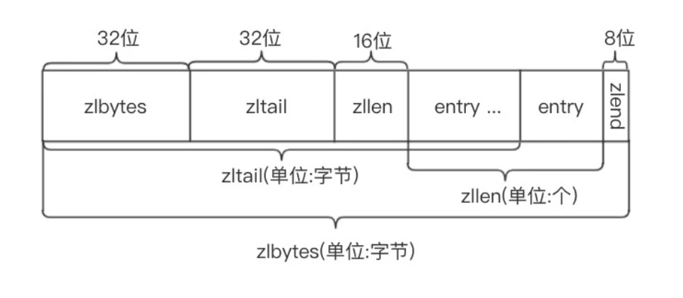
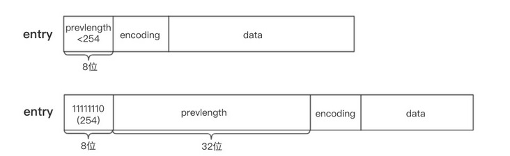
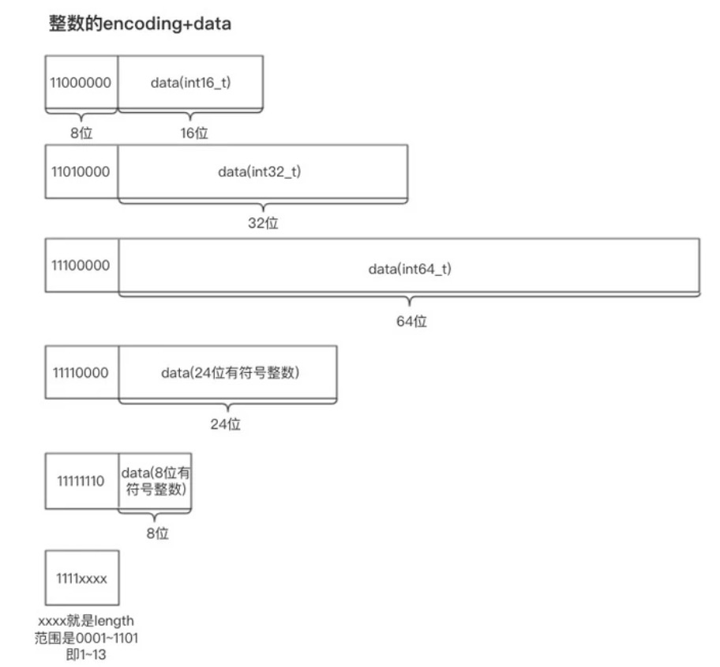
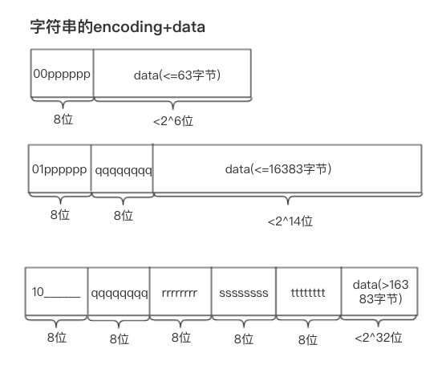
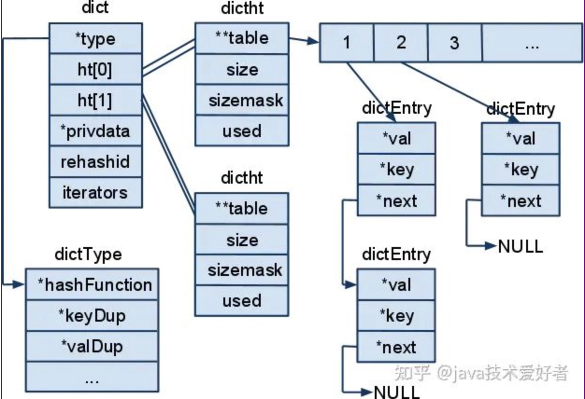
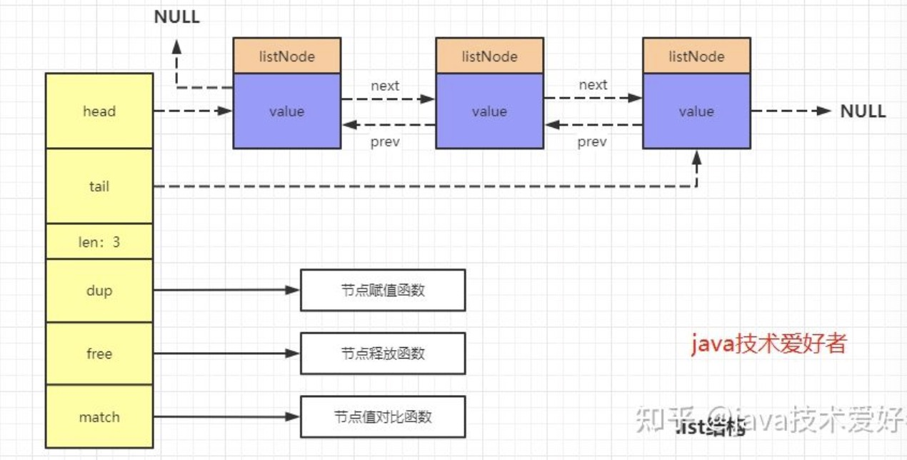
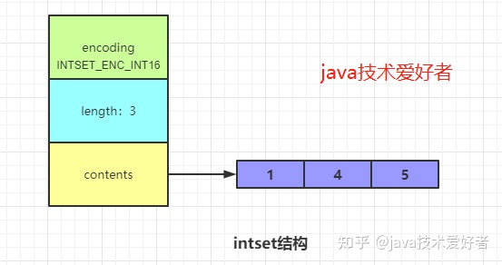
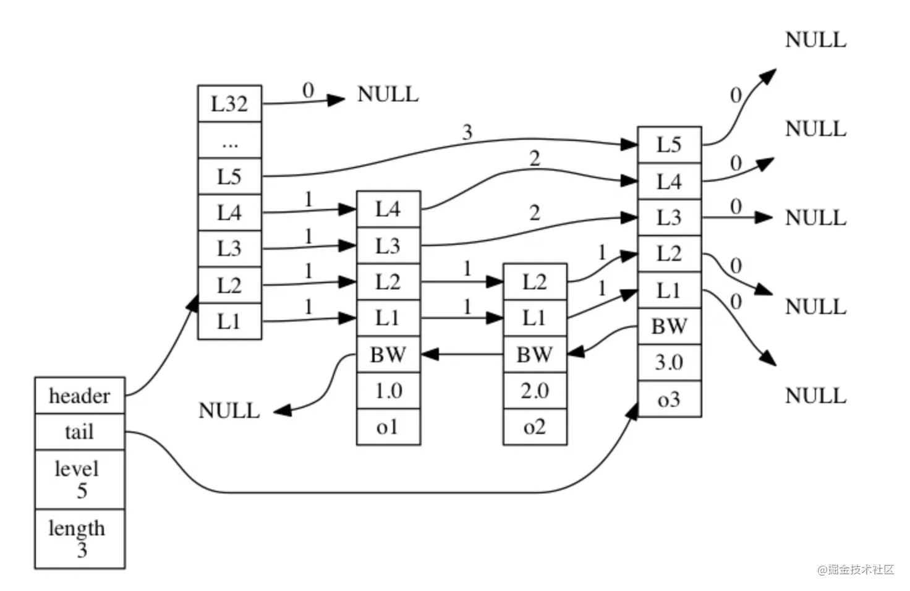
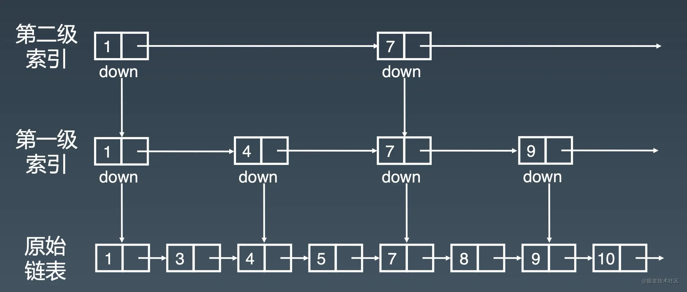

<!--
 * @Author: uestc.zyj@gmail.com
 * @Date: 2021-09-23 11:23:11
 * @LastEditTime: 2021-09-26 09:15:28
 * @Description: redis interview questions
 * @FilePath: /interviews/redis/redis.md
-->

# redis八股文

## redis五种数据类型的底层实现

**string(字符串)**
```c
//动态字符串实现如下
struct sdshdr{
 int len;/*字符串长度*/
 int free;/*未使用的字节长度*/
 char buf[];/*保存字符串的字节数组*/
}
```
C语言获取字符串长度是从头到尾遍历，时间复杂度是O(n)，而SDS有len属性记录字符串长度，时间复杂度为O(1)。
避免缓冲区溢出。SDS在需要修改时，会先检查空间是否满足大小，如果不满足，则先扩展至所需大小再进行修改操作。
空间预分配。当SDS需要进行扩展时，Redis会为SDS分配好内存，并且根据特定的算法分配多余的free空间，避免了连续执行字符串添加带来的内存分配的消耗。
惰性释放。如果需要缩短字符串，不会立即回收多余的内存空间，而是用free记录剩余的空间，以备下次扩展时使用，避免了再次分配内存的消耗。
二进制安全。c语言在存储字符串时采用N+1的字符串数组，末尾使用'\0'标识字符串的结束，如果我们存储的字符串中间出现'\0'，那就会导致识别出错。而SDS因为记录了字符串的长度len，则没有这个问题。

**ziplist(压缩列表) [在一定条件下同时作为list，hash，zset的底层实现之一]**

**当hash对象同时满足以下两个条件的时候，使用ziplist编码否则使用hashtable： a、所有的键值对的健和值的字符串长度都小于等于64byte（一个英文字母一个字节）； b、哈希对象保存的键值对数量小于512个。**

**当list的长度小于 512，并且所有元素的长度都小于 64 字节时，使用ziplist存储；否则使用 linkedlist 存储。**

**当zset的长度小于 128，并且所有元素的长度都小于 64 字节时，使用ziplist存储；否则使用 skiplist 存储。**


 

zlbytes: ziplist的长度（单位: 字节)，是一个32位无符号整数
zltail: ziplist最后一个节点的偏移量，反向遍历ziplist或者pop尾部节点的时候有用。
zllen: ziplist的节点（entry）个数
entry: 节点
zlend: 值为0xFF（255），用于标记ziplist的结尾

每个节点由三部分组成：prevlength、encoding、data
    prevlengh: 记录上一个节点的长度，为了方便反向遍历ziplist
    encoding: 当前节点的编码规则，下文会详细说
    data: 当前节点的值，可以是数字或字符串


 


entry的前8位小于254，则这8位就表示上一个节点的长度
**entry的前8位等于254，则意味着上一个节点的长度无法用8位表示，后面32位才是真实的prevlength。用254 不用255(11111111)作为分界是因为255是zlend的值，它用于判断ziplist是否到达尾部。**

整数节点的encoding的长度为8位，其中高2位用来区分整数节点和字符串节点（高2位为11时是整数节点），低6位用来区分整数节点的类型，定义如下:

根据当前节点存储的数据类型及长度，可以将ziplist节点分为9类：
其中整数节点分为6类：

 

字符串节点分为三类
 
当data小于63字节时(2^6)，节点存为上图的第一种类型，高2位为00，低6位表示data的长度。
当data小于16383字节时(2^14)，节点存为上图的第二种类型，高2位为01，后续14位表示data的长度。
当data小于4294967296字节时(2^32)，节点存为上图的第二种类型，高2位为10，下一字节起连续32位表示data的长度。


**hashtable（这里可能会考拉链法和开放寻址法）**

 


hashtable使用的是拉链法进行实现的，链表中的每个节点存储的是kv对，数组的元素是链表。

这里的重点是扩容和收缩的过程
1、如果执行扩展操作，会基于原哈希表创建一个大小等于 ht[0].used*2n 的哈希表（也就是每次扩展都是根据原哈希表已使用的空间扩大一倍创建另一个哈希表）。相反如果执行的是收缩操作，每次收缩是根据已使用空间缩小一倍创建一个新的哈希表。

2、重新利用哈希算法，计算索引值，然后将键值对放到新的哈希表位置上。

3、所有键值对都迁徙完毕后，释放原哈希表的内存空间。

在rehash时，会使用rehashidx字段保存迁移的进度，rehashidx为0表示迁移开始。

在迁移过程中ht[0]和ht[1]会同时保存数据，ht[0]指向旧哈希表，ht[1]指向新哈希表，每次对字典执行添加、删除、查找或者更新操作时，程序除了执行指定的操作以外，还会顺带将ht[0]的元素迁移到ht[1]中。

随着字典操作的不断执行，最终会在某个时间节点，ht[0]的所有键值都会被迁移到ht[1]中，rehashidx设置为-1，代表迁移完成。如果没有执行字典操作，redis也会通过定时任务去判断rehash是否完成，没有完成则继续rehash。

rehash完成后，ht[0]指向的旧表会被释放, 之后会将新表的持有权转交给ht[0], 再重置ht[1]指向NULL。

**list(链表)**

其实实现就是一个简单的双链表，有一个专门的结构题管理head和tail

 


**set(集合)**

在长度小于**512**的时候，且元素能够转换成int的对象，使用intset进行保存，有序保存，使用二分查找。
 

其他情况使用hashtable保存


**zset(有序集合)**

 

查询，增加，查找效率都是O(logn)

 

 上图会更好理解
